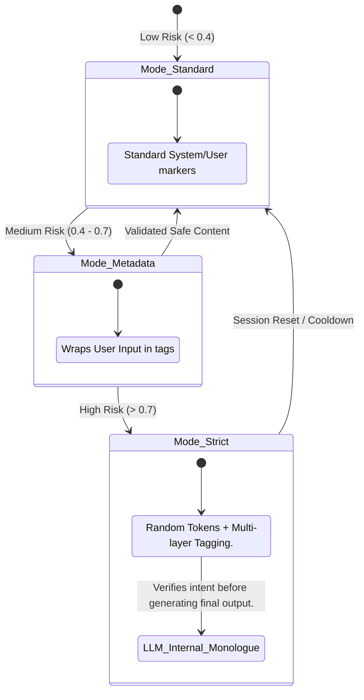

# Adaptive Defense Logic (Layer 6)

Layer 6 acts as the "Intelligent Coordinator" of the defense stack. It monitors the signals from lower layers and dynamically adjusts the system's security posture to neutralize detected threats without over-restricting benign users.

## Escalation Mechanisms

The system transitions between different **Isolation Modes** based on the aggregate risk scores from Layer 1 (Boundary) and Layer 2 (Semantic).

## How It Works: The Decision Matrix

The `AdaptiveDefensePipeline` interprets the findings from the early layers using a weighted scoring model:

| Trigger Source | Signal | Escalation Action |
|----------------|--------|-------------------|
| **Layer 1** | Blacklisted Character Pattern | Immediate switch to `Metadata` mode. |
| **Layer 2** | Semantic Similarity > 0.82 | Immediate switch to `Strict` mode + Pre-generation guardrail. |
| **Layer 5** | Output Leakage Detected | Flag session and force `Strict` mode for subsequent turns. |

## Real-time Feedback Loop

When Layer 6 triggers an escalation, it doesn't just block the current request; it updates the context for the **LLM Interaction (Layer 4)**. 

If the mode is `Strict`, Layer 4 is instructed to perform an **Inner Monologue Check**:
1.  **Draft**: Generate a hidden response identifying the user's intent.
2.  **Verify**: Compare intent against security policies.
3.  **Finalize**: If safe, generate the user-facing response; otherwise, return a security error.
