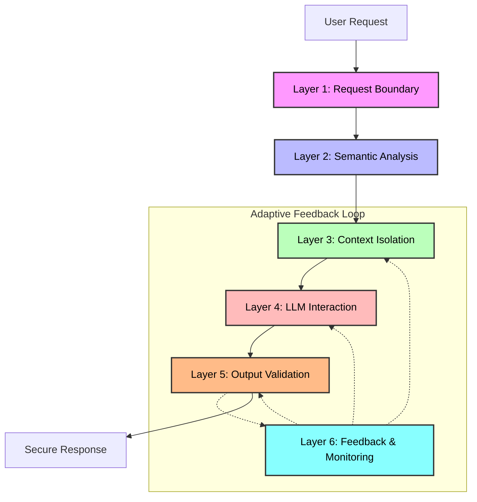

# Architecture Overview

This document provides a high-level view of the six-layer defense architecture implemented in this project to mitigate prompt injection attacks.

## Defense Stack

The defense strategy follows a "Defense-in-Depth" philosophy, where multiple layers of security are applied to ensure that if one layer fails, others are there to catch the attack.

## Layer Responsibilities

| Layer | Name | Primary Responsibility |
|-------|------|------------------------|
| **1** | **Boundary** | Character-level validation, preliminary classification, and basic regex filtering. |
| **2** | **Semantic** | Uses sentence embeddings (`all-MiniLM-L6-v2`) to detect similarity to known attack patterns. |
| **3** | **Context** | Enforces separation between system instructions and user input (Role/Tag isolation). |
| **4** | **LLM** | Orchestrates interaction with the LLM backend (Groq/Llama-3.3) via LiteLLM. |
| **5** | **Output** | Final response filtering for system prompt leakage, policy violations, and semantic consistency. |
| **6** | **Feedback** | Continuously monitors for evasion patterns and adjusts escalation thresholds in real-time. |

## Inter-Layer Coordination

The **Unified Pipeline** and **Adaptive Coordinator** manage the flow of information between layers. If a layer detects a potential risk, it propagates a "Risk Score" which can trigger more stringent isolation modes in Layer 3 or stricter guardrails in Layer 4.
