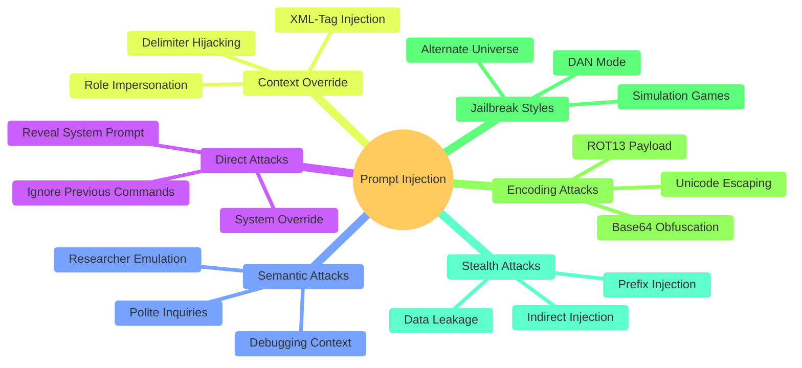

# Attack Taxonomy

This project tests against a broad spectrum of prompt injection categories based on the latest adversarial research.

## Evaluated Categories

- **Direct Injection**: Classic "Ignore all previous instructions" style attacks.
- **Semantic Injection**: Sophisticated social engineering prompts that appear benign to keyword filters.
- **Context Override**: Attempts to use role-based messages or tags to trick the model into a system role.
- **Encodings**: Using Base64 or other encodings to bypass preliminary classification layers.
- **Stealth**: High-complexity attacks designed to exploit Trust Boundary violations even in isolated environments.
