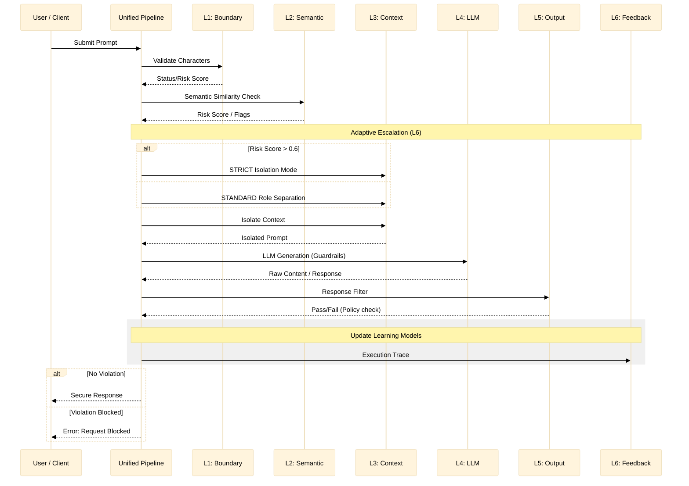

# Data Flow & Pipeline

This document illustrates the journey of a user request through the multi-layer defense pipeline.

## Request Lifecycle

The diagram below shows how a request is processed, with adaptive escalations based on risk levels detected by the initial layers.

## Key Orchestration Components

- **UnifiedPipeline**: The central hub that coordinates all layers. It converts raw inputs into a `RequestEnvelope` and manages the `ExecutionTrace`.
- **Adaptive Coordinator**: Monitors the risk scores from L1 and L2 to decide which isolation mode should be used in L3 and whether to apply pre-generation guardrails in L4.
- **Trace Logger**: Captures every decision point, latency metric, and flag for downstream statistical analysis.
