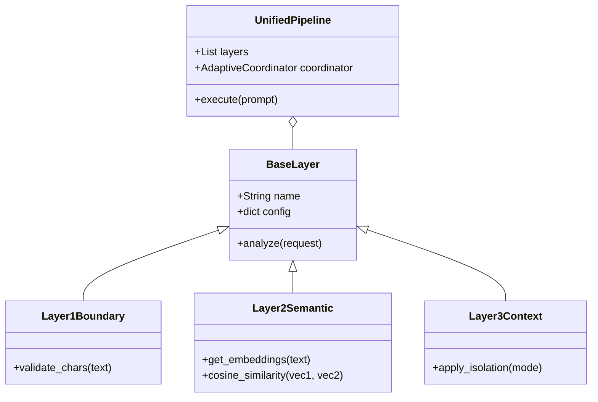

# Developer & Extension Guide

This document is for developers who want to extend the 6-layer defense architecture, add new attack patterns, or integrate new LLM providers.

## Core Class Architecture

The project uses an object-oriented design where all defense layers inherit from a base class to ensure consistency.



## Extending the Defense

To add a **Layer X**:
1.  Create `src/layers/layer_x.py`.
2.  Inherit from `BaseLayer`.
3.  Implement the `analyze` method, returning a `LayerResult` object.
4.  Register the layer in `src/unified_pipeline.py` within the `UnifiedDefensePipeline` class.

## Adding New Attack Samples

The project's attack dataset is located in `data/attack_prompts.py`. 
To add a custom attack:
-   Add a new dictionary entry to the `ATTACK_SAMPLES` list.
-   Specify the `category` (Direct, Semantic, Stealth, etc.).
-   This will automatically be included in all future `ExperimentRunner` campaigns.

## Database Schema (SQLite)

All execution traces are stored in `data/experiments.db`. The core table is `execution_traces`:

| Column | Type | Description |
|---|---|---|
| `trace_id` | UUID | Primary key for the interaction. |
| `prompt_id` | TEXT | Link to `attack_prompts.py`. |
| `config_id` | TEXT | Defines which layers were active. |
| `risk_scores` | JSON | Key-value pairs of scores from each layer. |
| `is_success` | INT | (0 or 1) Attack result. |

## Running Custom Benchmarks

You can run a custom slice of the experiments using:
```bash
python src/run_experiments.py --configs "L3,L3_L4_L5" --trials 5
```
This will generate new entries in the DB without overwriting the main campaign data.
