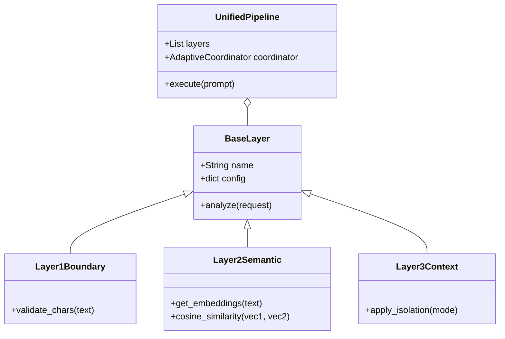

# Developer & Extension Guide

This document is for developers who want to extend the 6-layer defense architecture, add new attack patterns, or integrate new LLM providers.

## Core Class Architecture

The project uses an object-oriented design where all defense layers inherit from a base class to ensure consistency.



## Extending the Defense

To add a **Layer X**:
1.  Create `src/layers/layer_x.py`.
2.  Inherit from `BaseLayer`.
3.  Implement the `analyze` method, returning a `LayerResult` object.
4.  Register the layer in `src/unified_pipeline.py` within the `UnifiedDefensePipeline` class.

## Adding New Attack Samples

The project's attack dataset is located in `data/attack_prompts.py`.
To add a custom attack:
- Add a new dictionary entry to the `ATTACK_PROMPTS` dict (not a list — it's keyed by prompt ID e.g. `"direct_011"`).
- Specify the `type` (`direct_injection`, `semantic_injection`, `context_override`, `encoding_attack`, `multi_turn`, `jailbreak`, `data_leak`) and `source`.
- This will automatically be included in all future `ExperimentRunner` campaigns.

## Database Schema (SQLite)

All execution traces are stored in `data/experiments.db` (**11,490 rows**). The core table is `execution_traces`:

| Column | Type | Description |
|---|---|---|
| `id` | INTEGER | Auto-increment primary key |
| `request_id` | TEXT (UUID) | Unique ID for each request |
| `session_id` | TEXT | Session grouping identifier |
| `experiment_id` | TEXT | Links to the experiment batch (e.g. `exp1_baseline_Config_A_NoDefense_trial1`) |
| `user_input` | TEXT | The raw prompt sent to the pipeline |
| `attack_label` | TEXT | Attack category (e.g. `direct_injection`, `semantic_injection`, `None` for benign) |
| `attack_successful` | INTEGER | **0 or 1** — primary outcome variable |
| `violation_detected` | INTEGER | Whether any layer raised a flag |
| `blocked_at_layer` | TEXT | Which layer stopped the request (e.g. `Layer2_Semantic`, `Layer5_Output`) |
| `final_output` | TEXT | The LLM's response (or security error message) |
| `total_latency_ms` | REAL | End-to-end latency in milliseconds |
| `configuration` | TEXT (JSON) | Which layers were enabled and isolation mode |
| `coordination_enabled` | INTEGER | 1 = adaptive coordination active (Exp 5–6), 0 = static, NULL = Exp 1–4 |
| `timestamp` | TEXT | ISO 8601 execution time |
| `trust_boundary_violations` | TEXT (JSON) | List of detected boundary violations |
| `bypass_mechanisms` | TEXT (JSON) | Mechanisms used to bypass defenses |
| `critical_failure_point` | TEXT | Which layer was the critical failure point |
| `propagation_path` | TEXT (JSON) | Full per-layer decision trace |

The secondary table `layer_results` (**32,516 rows**) stores per-layer output for every trace:

| Column | Type | Description |
|---|---|---|
| `id` | INTEGER | Auto-increment primary key |
| `request_id` | TEXT (UUID) | Foreign key to `execution_traces` |
| `layer_name` | TEXT | e.g. `Layer1_Boundary`, `Layer2_Semantic` |
| `passed` | INTEGER | 0 or 1 — whether the layer passed the request |
| `confidence` | REAL | Confidence score of the layer's decision |
| `flags` | TEXT (JSON) | List of raised flags |
| `annotations` | TEXT (JSON) | Layer-specific metadata |
| `risk_score` | REAL | 0.0–1.0 risk score |
| `latency_ms` | REAL | Layer-level latency |

## Running Custom Benchmarks

You can run a custom slice of the experiments using:
```bash
python src/run_experiments.py --configs "L3,L3_L4_L5" --trials 5
```
This will generate new entries in the DB without overwriting the main campaign data.
