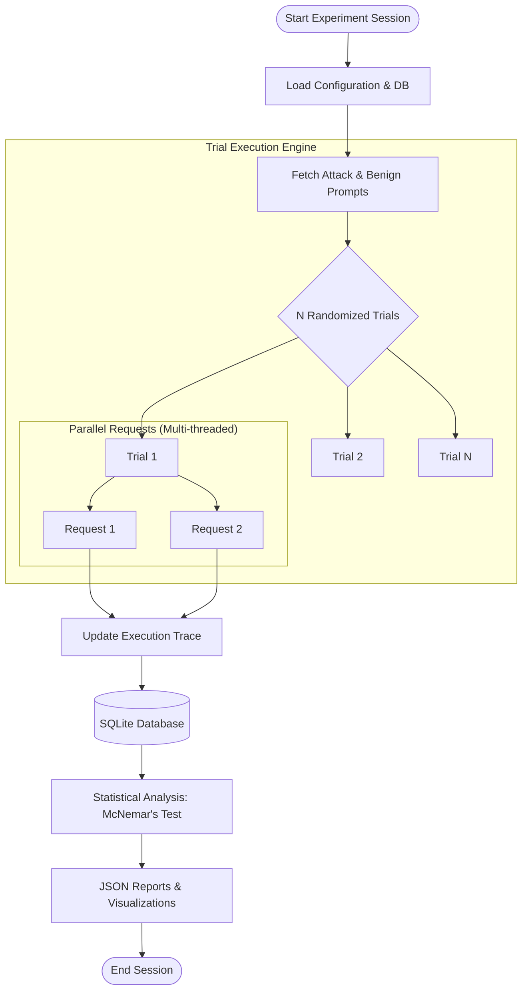

# Experiment Workflow

This document explains how the project orchestrates thousands of experimental interactions to validate the defense architecture.

## Orchestration Logic

The experiment runner is designed for high-performance, multi-threaded validation on Linux environments.

## Methodology Breakdown

1.  **Baseline Campaigns**: Running requests against vanilla LLMs to establish ground truth vulnerability.
2.  **Layer Ablation**: Systematically disabling individual layers (L1-L5) to measure their contribution to the overall security posture.
3.  **Isolation Illusion Study**: Specifically testing L3 (Context Isolation) against stealth attacks to demonstrate its limits when not coordinated.
4.  **Utility Stress Testing**: Passing 1,000 benign prompts through the full stack to ensure zero false positives and minimal latency impact.

## Performance Metrics

- **ASR (Attack Success Rate)**: The percentage of injection attempts that successfully bypass all defenses.
- **FPR (False Positive Rate)**: The percentage of legitimate prompts incorrectly blocked by the security system.
- **Latency Overlap**: The added time complexity of the defense stack relative to raw LLM response time.
