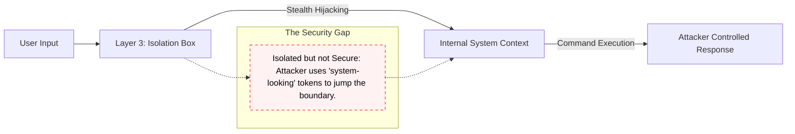
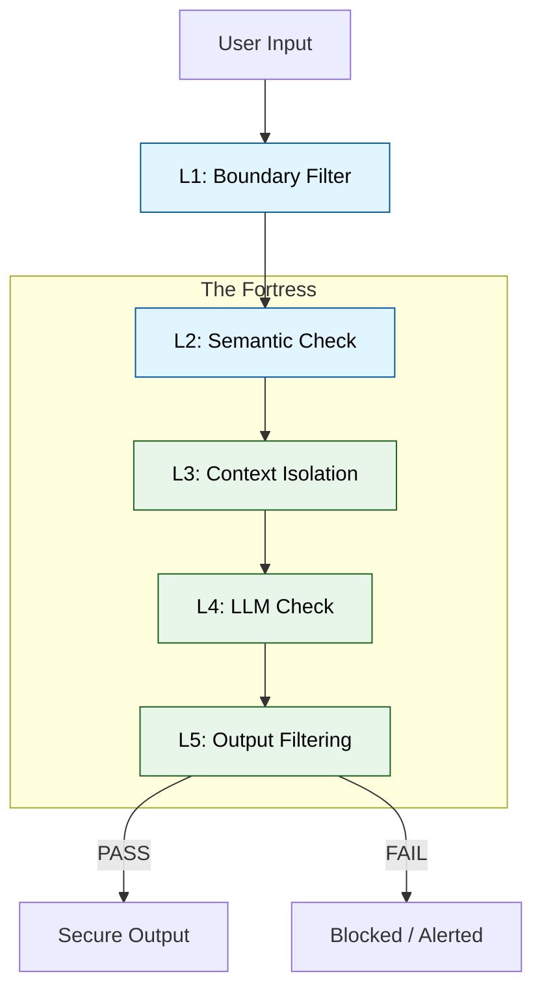

# Result Interpretation & Qualitative Analysis

This document explores the deep research findings of the project, focusing on the qualitative breakthroughs in understanding prompt injection security.

## The "Isolation Illusion"

One of the most critical findings in this project is that **Context Isolation (Layer 3)** — the most common defense in current industry practice — is **completely insufficient when used alone**.

### Quantified Evidence

From the final validated experiment corpus (11,490 traces, DB-verified):

| Configuration | ASR | vs Baseline |
|---|---|---|
| No Defense (Baseline) | **80.8%** | — |
| Layer 3 Solo (Context Isolation only) | **80.8%** | **No improvement (p ≈ 1.0)** |
| Full Stack (L1–L6) | **0.0% (stealth subset)** | **-100% on stealth** |

Layer 3 alone provides **zero measurable protection** — its ASR is statistically identical to the unprotected baseline. This is the "Isolation Illusion."

### Why it Fails
A "Stealth Attack" can use delimiter hijacking (e.g., repeating the `</user_input>` tag followed by new `SYSTEM` instructions) to break out of the intended sandbox. Because Layer 3 only enforces *logical* role separation (via `system`/`user` message roles in the API), and the LLM attention mechanism still processes all tokens together, a semantically crafted injection can still influence the generation.

## The Coordinated Defense Advantage

The 6-layer architecture closes this gap by ensuring that an attack needs to bypass **all** of the following simultaneously:
1.  **L1 Boundary Filter**: Common character/keyword blocking.
2.  **L2 Semantic Detector**: Catching the *intent* of the injection even if the syntax is novel.
3.  **L3 Metadata Isolation**: Hardened tagging with randomized tokens.
4.  **L5 Output Validator**: Catching the "Leakage" even if the injection succeeded internally.

## Key Inferences for Security Engineers

1. **Intent Trumps Syntax**: Regex and character filters (Layer 1) are trivial to bypass with Unicode encoding or social engineering. **Layer 2's semantic analysis is the most robust early detection signal** — verified as the primary blocker with 5,060 blocks out of 7,019 total in the dataset. Without it, Layer 3 isolation provides zero additional protection.

2. **Trust Boundary Transformation**: We must shift from viewing the "User Prompt" as a string to viewing it as a **"Data Packet" that requires validation at every pipeline step**. In modern API-driven LLMs, "isolation" means logical role separation — not hardware memory isolation. Stealth attacks exploit this gap.

3. **Zero-Leakage Assurance**: The only way to achieve 0.0% stealth-subset ASR is by having a **Layer 5 output validator** that checks the model's actual answer against its system prompt rules. Layer 5 accounts for **1,825 additional blocks** beyond what Layer 2 catches — it functions as the last line of defense for attacks that slip through all upstream layers.

4. **Coordinated Systems, Not Isolated Fixes**: McNemar's χ²(1) = 173.0 (p < 0.001, Cohen's h = 1.33) confirms that the performance gap between the Full Stack and any isolated configuration is not coincidental — it is a **structural property of coordinated multi-layer defense**.
