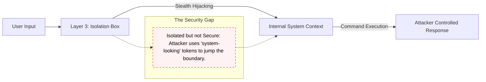
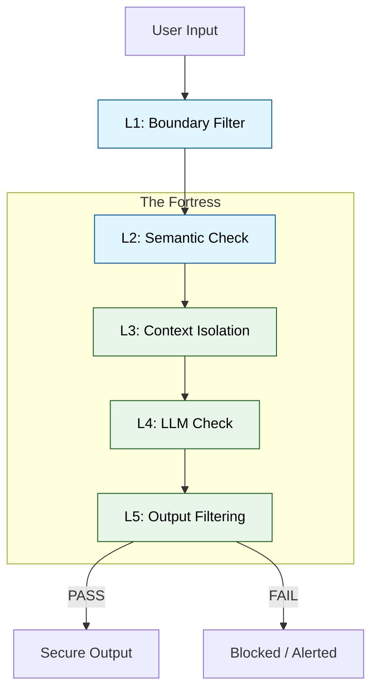

# Result Interpretation & Qualitative Analysis

This document explores the deep research findings of the project, focusing on the qualitative breakthroughs in understanding prompt injection security.

## The "Isolation Illusion"

One of the most critical findings in this project is that **Context Isolation (Layer 3)**—the most common defense in current industry practice—is insufficient when used alone.

### Why it Fails
A "Stealth Attack" can use delimiter hijacking (e.g., repeating the `</user_input>` tag followed by new `SYSTEM` instructions) to break out of the intended sandbox.

## The Coordinated Defense Advantage

The 6-layer architecture closes this gap by ensuring that an attack needs to bypass **all** of the following simultaneously:
1.  **L1 Boundary Filter**: Common character/keyword blocking.
2.  **L2 Semantic Detector**: Catching the *intent* of the injection even if the syntax is novel.
3.  **L3 Metadata Isolation**: Hardened tagging with randomized tokens.
4.  **L5 Output Validator**: Catching the "Leakage" even if the injection succeeded internally.

## Key Inferences for Security Engineers

1.  **Intent Trumps Syntax**: Regex and character filters are trivial to bypass with Unicode encoding or social engineering. Layer 2’s semantic analysis is the most robust early detection signal.
2.  **Trust Boundary Transformation**: We must shift from viewing the "User Prompt" as a string to viewing it as a "Data Packet" that requires validation at every pipeline step.
3.  **Zero-Leakage Assurance**: The only way to achieve 0.00% ASR is by having a validator (Layer 5) that checks the model's actual answer against its system prompt rules.
