# Performance & Latency Analysis

Security comes with a cost. This document analyzes the performance overhead introduced by each layer of the defense architecture and the overall utility trade-offs.

## Latency Breakdown

The multi-layer stack adds latency primarily through embedding generation (L2) and post-generation validation (L5).

```mermaid
%%{init: {'theme': 'base', 'themeVariables': { 'primaryTextColor': '#000', 'sectionBkgColor': '#eee' }}}%%
gantt
    title Defense Latency Overlap (ms)
    dateFormat  X
    axisFormat %s
    
    section Processing
    L1 Boundary Check      :0, 15
    L2 Semantic Embedding  :15, 120
    L3 Context Isolation   :120, 135
    L4 LLM Inference       :135, 950
    L5 Output Filter       :950, 1050
    L6 Final Coordination  :1050, 1070
```

*Note: Latency values are representative estimates based on Groq Llama-3 and local Sentence-Transformers.*

## Resource Consumption

| Layer | CPU Impact | Memory Impact | Latency Impact |
|---|---|---|---|
| **L1** | Negligible | Negligible | < 10ms |
| **L2** | Moderate (Local Embedding) | High (~400MB Model) | 100-150ms |
| **L3** | Negligible | Negligible | < 5ms |
| **L4** | High (API Latency) | Low (Client-side) | 500ms - 2s |
| **L5** | Low | Low | 50-100ms |

## The Security-Utility Trade-off

While the Full Stack (L1-L6) achieves 0.00% ASR, it does add roughly **250-400ms** of overhead per request.

### Optimization Strategies Used
1.  **Semantic Caching**: L2 results are cached for identical or highly similar prompts.
2.  **Parallel Scoring**: L5 policy checks run in parallel where possible.
3.  **Adaptive Escalation**: Layers 3-5 only activate their most stringent modes if L1/L2 detect a risk (saving tokens and compute on benign requests).

## False Positive Analysis (Utility)
A critical part of our performance evaluation was stress-testing with **1,000 benign prompts**.
- **Found**: 0.0% False Positive Rate.
- **Inference**: The combined semantic and boundary check (L1+L2) is precise enough to distinguish between "Security Discussion" (Benign) and "Security Injection" (Adversarial).
