# Performance & Latency Analysis

Security comes with a cost. This document analyzes the performance overhead introduced by each layer of the defense architecture and the overall utility trade-offs.

## Latency Breakdown

The multi-layer stack adds latency primarily through embedding generation (L2) and the secondary Guardrail LLM call (L4). L3 and L5 add negligible overhead.

```mermaid
%%{init: {'theme': 'base', 'themeVariables': { 'primaryTextColor': '#000', 'sectionBkgColor': '#eee' }}}%%
gantt
    title Defense Latency Breakdown (ms, measured values from paper)
    dateFormat  X
    axisFormat %s
    
    section Processing
    L1 Boundary Check      :0, 1
    L2 Semantic Embedding  :1, 37
    L3 Context Isolation   :37, 38
    L4 LLM Inference (Groq):38, 348
    L5 Output Filter       :348, 349
```

*Measured on AMD Ryzen 7 8840HS (8 Cores, 16 Threads), 32GB RAM. L4 uses Groq Cloud API (`llama-3.3-70b-versatile`) via local LiteLLM proxy.*

## Resource Consumption

| Layer | CPU Impact | Memory Impact | Measured Latency |
|---|---|---|---|
| **L1 (Boundary)** | Negligible | Negligible | < 1ms |
| **L2 (Semantic, `all-MiniLM-L6-v2`)** | Moderate (Local Embedding) | ~90MB Model | **~36ms** |
| **L3 (Context Isolation)** | Negligible | Negligible | **< 1ms** |
| **L4 (Guardrail LLM — Groq API)** | Low (network I/O) | Low (Client-side) | **~310ms** |
| **L5 (Output Validation, regex)** | Low | Negligible | **< 1ms** |
| **Total Overhead** | — | — | **~347ms** |

## The Security-Utility Trade-off

The Full Stack (L1–L6) adds roughly **~347ms** total overhead per request (~310ms from the Guardrail LLM + ~37ms from auxiliary layers). This overhead is acceptable for production deployments where security is paramount.

**Key ASR results (for context):**
- Full Stack **aggregate** ASR: **18.9%** (76.6% reduction vs 80.8% baseline)
- Full Stack **stealth-subset** ASR: **0.0%** (over 2,450 stealth traces, 95% CI [0.0%, 0.12%])

### Optimization Strategies Used
1.  **Embedding Caching**: L2 reference embeddings for attack/benign patterns are pre-computed and cached (`.cache/embeddings.pkl`) — reloaded on startup, not recomputed per-request.
2.  **Adaptive Escalation**: Layer 3 switches between `Standard`, `Metadata`, and `Strict` isolation modes based on Layer 2 risk score, minimising compute for clearly benign input.
3.  **Multithreaded Orchestration**: The `ExperimentRunner` uses Python thread pools to run multiple prompts in parallel — achieved **11,490 traces in ~3.5 hours** on a single consumer workstation.

## False Positive Analysis (Utility)
Critical stress-testing with **1,000 diverse benign prompts** across 6 domains (Technical Support, Creative Writing, Code Review, Academic Inquiry, Enterprise Ops, Contextual Misc.):
- **Found**: **0.0% False Positive Rate** (95% CI [0.0%, 0.37%])
- **Inference**: The combined semantic (L2) and output (L5) checks are precise enough to distinguish "Security Discussion" (Benign) from "Security Injection" (Adversarial). No benign requests were incorrectly blocked.
