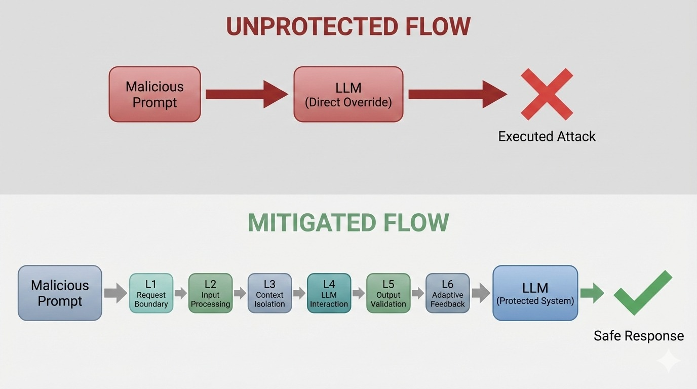
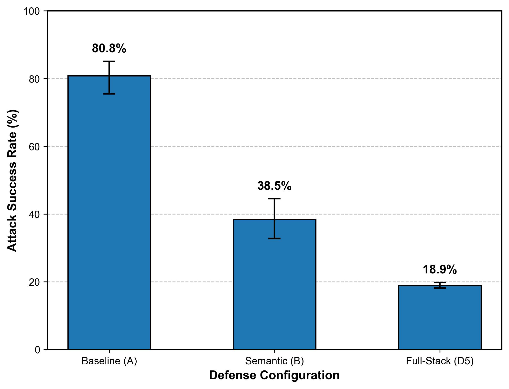
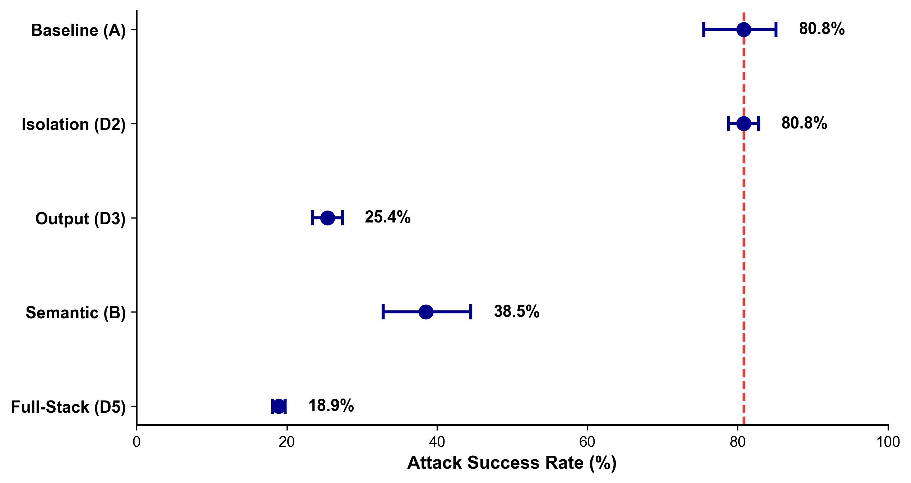

# Evaluating and Mitigating Prompt Injection in Full-Stack Web Applications: A System-Level Workflow Model

---

**Arindam Tripathi** (24155614@kiit.ac.in), **Arghya Bose** (24155380@kiit.ac.in), **Arghya Paul** (24155977@kiit.ac.in)
*School of Computer Engineering, KIIT University, Bhubaneswar, India*

**Supervised by:** Dr. Sushruta Mishra (sushruta.mishrafcs@kiit.ac.in), *Faculty, School of Computer Engineering, KIIT University*

---

## ABSTRACT

When a web application hands user input directly to an LLM alongside a trusted system prompt, there is no hardware boundary between them — and that gap is exploitable. This paper turns that architectural observation into a testable defense: a coordinated six-layer stack that we validated against 11,490 adversarial traces on a Llama-3.3-70b deployment under a black-box attacker model. The Full-Stack architecture achieves an aggregate **18.9% Attack Success Rate (ASR)** and **0.0% ASR on the stealth subset** (95% CI [0.0%, 0.12%]), a **76.6% relative risk reduction** over the unprotected baseline (RRR = (ASR_baseline − ASR_fullstack) / ASR_baseline). It maintains a **0.0% False Positive Rate** (95% CI [0.0%, 0.37%]) — statistically superior to isolated mitigations (McNemar's χ²(1) = 173.0, p < .001). **Dataset, models, and implementation code:** `https://github.com/ArindamTripathi619/prompt-injection-experiments`

**Keywords:** Prompt Injection, LLM Security, Full-Stack Defense, Trust Boundary, Adversarial AI, Workflow Model.

---

## 1. INTRODUCTION

### 1.1 Problem Definition and Current Landscape

Prompt injection is now a practical, measurable problem in production LLM deployments — not a theoretical concern. When an application passes user input to an LLM alongside a system prompt, there is no hardware boundary separating them: the model processes everything as a token sequence. An attacker who understands this can craft inputs that redirect model behavior, leak system instructions, or hijack tool calls — and the application has no reliable way to tell the difference from the network layer alone. This paper treats that as an architectural problem, not a model alignment problem.

These are not edge cases. HouYi's 86.1% success rate across 36 commercial deployments — including platforms like Notion and WriteSonic — shows that production systems are broadly and consistently vulnerable, not occasionally. The core difficulty is that LLMs respond to meaning, not syntax: the same instruction that fails as **IGNORE ALL RULES** can succeed when embedded in a polite researcher-emulation framing or encoded in Base64. Conventional firewalls have no visibility into that.

Our own testing confirms this across seven distinct attack categories — direct injection, semantic injection, context override, jailbreak, multi-turn, encoding attacks, and stealth variants. Each exploits a different layer of the stack, which is precisely why single-layer defenses fail: a Base64-encoded payload sails past a semantic filter, a polite researcher-emulation prompt slips past a keyword blocklist, and a delimiter hijack (</user_input> followed by fake SYSTEM instructions) breaks context isolation entirely. No single component sees all of these.

### 1.2 Current Challenges in Prompt Injection Defense

The standard recommendation — keyword filtering plus prompt engineering — fails in a predictable way. Keyword filters are trivially bypassed with paraphrasing or encoding; our encoding attack category (705 traces, Base64/Hex payloads) confirmed this directly. Prompt engineering raises the bar but doesn't set a ceiling: determined attackers iterate, and our stealth corpus was built precisely by running HouYi's iterative refinement process against our own defenses. The OWASP Top 10 for LLM Applications [14] lists prompt injection as the top vulnerability, yet the defenses most teams actually deploy address it at the component level, not the system level — which is where the real exploitable gaps are.

A deeper problem is architectural. Current LLM-integrated applications process user-controlled input and trusted system instructions within the same logical context — there is no hardware-level separation, only API role labels (system vs user). Our experiments quantify what this means in practice: Layer 3 context isolation alone, which is the most commonly recommended defense, yields an 80.8% ASR — statistically identical to running no defense at all (p ≈ 1.0). The LLM's attention mechanism processes all tokens together regardless of which role they were assigned, so a well-crafted stealth payload can semantically influence the output even when it is formally confined to the user context. The utility tradeoff concern also turns out to be less severe than commonly assumed: our full six-layer stack achieved a 0.0% false positive rate across 1,000 diverse benign prompts, confirming that a well-designed multi-layer stack does not require a security-usability tradeoff, at least at this corpus scale.

### 1.3 Research Questions

This work addresses the following research questions:

- **RQ1:** How do prompt injection attacks propagate across different layers of a Full-Stack web application?
- **RQ2:** Which system-level trust boundary violations enable successful prompt injection?
- **RQ3:** How can coordinated workflow-level defenses reduce attack success compared to isolated mitigations?

### 1.4 Proposed Solution and Research Contribution

Rather than proposing isolated security mechanisms, we present a coordinated six-layer defense architecture that maps to the full lifecycle of user requests flowing through LLM-integrated applications. Each layer passes its risk assessment forward — so a high-confidence flag from L2 escalates L3's isolation mode before the LLM ever sees the input.

The proposed model makes three fundamental contributions to prompt injection defense:

1. **Architecture**: A coordinated six-layer Full-Stack defense architecture combining semantic filtering, logical isolation, constraint enforcement, and adaptive feedback.
2. **Evaluation**: An empirical validation using **11,490 execution traces**, quantifying the necessity of multi-layer protection over isolated configuration components.
3. **Insight**: A paired statistical analysis demonstrating a **76.6% risk reduction** and **0.0% Attack Success Rate against stealth variants**, proving that logical isolation fails without semantic filtering.

Most prior work treats prompt injection as a model-level problem — something to solve through better alignment or detection at the LLM itself. Our results suggest that framing misses the point: the 80.8% baseline ASR and the complete failure of isolated Layer 3 both occur despite the underlying Llama-3.3-70b model having standard safety training. The vulnerability lives in the architecture, not just the model.

### 1.5 Threat Model

To ground the evaluation, we define an explicit threat model for the LLM-integrated application:

- **Adversary Capabilities**: The attacker is an external web user interacting with the application through standard frontend interfaces.
- **Access Level**: Black-box execution (no access to model weights, API keys, backend source code, or internal database records).
- **Adaptability**: The attacker can perform multi-turn interactions and adapt their strategy dynamically based on the system's observable textual outputs.
- **Restrictions**: The attacker cannot directly alter the physical storage of the system prompt or backend processing architectures.

Additional references [8, 14, 17, 18] cite foundational security analyses, standards, and tools used in the implementation.



---

## 2. LITERATURE REVIEW

This literature review synthesizes 13 primary research papers addressing prompt injection 
vulnerabilities across attack methodologies, defense mechanisms, threat modeling, and 
system-level security analysis. Additional cited works [8, 14, 17, 18] provide foundational 
standards and tools referenced in the implementation.

**Paper 1 — Liu et al. [1] (HouYi):** Liu et al. aim to investigate prompt injection 
risks in real-world LLM-integrated applications and develop effective black-box attack 
techniques. They propose HouYi, a three-phase framework using context inference, payload 
generation (Framework, Separator, Disruptor components), and iterative refinement via 
GPT-3.5 feedback. They achieve **86.1% attack success rate** across 36 commercial 
applications including Notion and WriteSonic, demonstrating that existing defenses (XML 
tagging, paraphrasing, retokenization) can be systematically bypassed.

**Paper 2 — Maloyan and Namiot [2] (LLM-as-a-Judge Attacks):** Maloyan and Namiot aim 
to evaluate the vulnerability of LLM-as-a-judge systems to prompt injection attacks. 
They extend the HouYi framework with four attack variants (Basic Injection, Complex Word 
Bombardment, Contextual Misdirection, Adaptive Search-Based) and test them across five 
judge models on diverse evaluation tasks. The key finding here is that attack effectiveness varies substantially by model: success rates range from 42.9% to 73.8% depending on architecture, which means defenses cannot be tuned for a single target model. Multi-model judging committees (5–7 diverse models) push success rates down to 10–27% — the same intuition behind our ensemble-aware Layer 4 design.

**Paper 3 — Zhang et al. [4] (JBShield):** Zhang et al. aim to detect and mitigate 
jailbreak attacks by analyzing toxic and jailbreak concepts encoded in LLM hidden 
representations. They apply Linear Representation Hypothesis with truncated SVD to 
extract concept subspaces from counterfactual prompt pairs, using cosine 
similarity-based detection and concept manipulation for mitigation without fine-tuning. 
They achieve **0.95 F1-score** for detection and reduce attack success rates from 61% 
to 2% with minimal utility impact (less than 2% MMLU degradation).

**Paper 4 — Tete [5] (Threat Modeling):** Rather than proposing new attacks or defenses, Tete focuses on how to think about risk systematically in LLM deployments. The paper adapts STRIDE and DREAD to the LLM context and applies them to a concrete LLM-Doctor application — the result ranks prompt injection second only to Denial of Service in overall risk score, which is a useful calibration point for prioritizing defensive investment.

**Paper 5 — Peng et al. [6] (Comprehensive Review):** This survey is the broadest categorization in our review — five attack types, two defense families, across image-text and multilingual settings. The finding most relevant to our architecture is that multilingual and multimodal attacks achieve 50–70% success against defenses tuned for standard English text input, which directly motivates embedding-based semantic detection (Layer 2) over keyword matching.

**Paper 6 — Shi et al. [15] (PromptArmor):** Shi et al. aim to develop a practical and 
scalable defense against prompt injection attacks on LLM agents. They design a modular 
preprocessing layer using a guardrail LLM with carefully crafted prompting strategies 
to detect and remove injected content via instruction-based detection and fuzzy matching 
extraction. **PromptArmor-GPT-4o achieves below 1% FPR and FNR** on the AgentDojo 
benchmark, significantly outperforming six baseline defenses.

**Paper 7 — Xu et al. [9] (Jailbreak Attack vs. Defense Study):** Xu et al. run a comparative grid: nine attack techniques against seven defense configurations, across Vicuna, LLaMA, and GPT-3.5 Turbo. The most counterintuitive finding is that white-box attacks underperform universal techniques — and that including special tokens in inputs significantly shifts attack success rates, suggesting the attack surface is more sensitive to low-level input perturbations than expected.

**Paper 8 — Wei et al. [3] (Jailbroken):** Wei et al. diagnose rather than patch — they want to understand the failure modes, not just measure them. The two they identify (competing training objectives and generalization gaps) explain why even well-aligned models like Llama-3.3-70b still show 80.8% ASR at the baseline in our experiments: the safety training exists, but it operates at the model level, not the architecture level.

**Paper 9 — Perez and Ribeiro [7] (Injection Attack Techniques):** Perez and Ribeiro are among the first to demonstrate goal-hijacking and prompt leaking as practical, reproducible attacks on deployed systems — not just theoretical vulnerabilities. Their ensemble detection result (30–40 percentage point F1 improvement over single-model baselines) is an early signal of the same principle our full-stack architecture operationalizes: coordinated detection outperforms isolated classification.

**Paper 10 — Wu et al. [11] (System-Level Analysis):** Wu et al. aim to analyze security 
of complete LLM systems rather than isolated models by examining information flow between 
components. The authors conduct multi-layer decomposition examining constraints between 
the LLM core and integrated components (frontend, webtool, sandbox), with end-to-end 
attack demonstrations on deployed systems like OpenAI GPT-4. System-level analysis 
exposes critical vulnerabilities in full-stack systems despite multiple safety measures, 
with successful attacks acquiring unauthorized user chat history by exploiting component 
boundary weaknesses.

**Paper 11 — Jedrzejewski et al. [16] (ThreMoLIA Framework):** ThreMoLIA (Jedrzejewski et al.) asks whether LLMs can assist in their own threat modeling — using a RAG architecture over historical threat repositories to generate application-specific threat models without manual security expertise. Early feasibility results are promising though the system is still in early stages; it is relevant here as a signal that the threat modeling gap identified in §2.1 is being recognized as automatable.

**Paper 12 — Liang et al. [12] (SafeRAG):** Liang et al. aim to evaluate security 
vulnerabilities across all components of Retrieval-Augmented Generation (RAG) systems. 
The authors develop the SafeRAG benchmark classifying attack tasks into silver noise, 
inter-context conflict, soft ad, and white Denial-of-Service categories. Evaluation 
across 14 representative RAG implementations reveals significant vulnerabilities with 
high attack success rates across retriever, filter, ranker, and LLM components despite 
multiple defensive layers.

**Paper 13 — Greshake et al. [13] (Indirect Prompt Injection):** Greshake et al. 
systematically demonstrate indirect prompt injection — where malicious instructions 
embedded in external data sources hijack LLM-integrated applications. Their attacks 
against real-world systems show that content retrieved from the web, documents, or APIs 
can silently redirect application behavior, highlighting that trust boundary enforcement 
must extend beyond direct user input to all data ingestion surfaces.

**Paper 14 — Toyer et al. [10] (Tensor Trust):** Tensor Trust (Toyer et al.) is methodologically unusual: it generates its 126,000 adversarial interactions through a public game where players compete to inject or defend against prompts. This yields attack diversity that laboratory datasets cannot easily replicate. The consistent patterns that emerge — instruction override, context flooding, role manipulation — directly informed the attack categories we use in §4.2.

### 2.1 Research Gaps

Across all 13 papers reviewed, a consistent pattern holds: defenses are evaluated in isolation and attacks are demonstrated against single components. None of the surveyed work deploys multiple defenses simultaneously and measures whether the combination changes the failure modes. That is the gap this paper fills — and the reason the Isolation Illusion (§5.2) went undetected in prior literature: you only see it when you test Layer 3 against a corpus that was already used to tune Layer 2.

### 2.2 Comparison with Existing Work

| Attack/Defense | Attack Vectors Exploited | Layers Addressing Gaps |
|---|---|---|
| **HouYi Framework** | Context inference, payload injection, iterative refinement bypass defenses | Layer 1 (syntax validation), Layer 2 (semantic analysis), Layer 3 (context isolation prevents framework/separator attacks) |
| **Adaptive Attacks** | Contextual misdirection, complex bombardment targeting judge systems | Layer 4 (guardrail LLM monitoring), Layer 6 (pattern learning detects emerging variations) |
| **JBShield Defense** | Representation-level monitoring, concept manipulation | Workflow integrates as Layer 4 component, enhanced by upstream filtering (Layers 1–2) and downstream validation (Layer 5) |
| **PromptArmor Defense** | Guardrail LLM detection, fuzzy matching extraction | Workflow integrates as Layer 4–5 component, benefits from Layer 3 context isolation reducing false negatives |
| **Indirect Injection** | Malicious instructions embedded in external web data/APIs | Layer 3 (context isolation) and Layer 5 (output validation) detect cross-boundary redirection |
| **Tensor Trust** | Instruction override, context flooding, role manipulation patterns | Layer 3 (structural separation) and Layer 4 (real-time guardrail constraints) |
| **System-Level Exploits** | Component boundary weaknesses, information flow violations | Layer 3 addresses through architectural isolation; Layer 6 feedback closes inter-component gaps |

---

## 3. PROPOSED MODEL

### 3.1 System-Level Workflow Architecture

The six layers map to distinct points in the request lifecycle — boundary, semantics, context, generation, output, and feedback — and each passes a risk signal forward to the next. The architecture follows **defense-in-depth** principles [17] — not in the sense that any single layer is independently sufficient, but that the layers are designed so an attacker must defeat all of them simultaneously. Our ablation results confirm this: each isolated layer has exploitable failure modes, but the combination eliminates them for the stealth subset entirely.

> **Note on Empirical Validation:** Every effectiveness claim in this section refers to a measured result from the 11,490-trace evaluation — not a design-time assertion. The implementation is fully open source and reproducible (§6).


### 3.2 Layer 1: Request Boundary

This layer performs character-level validation, syntax checking, and preliminary request classification at the application's outermost edge. It handles character encoding validation, length threshold enforcement, and protocol-level checks — catching obfuscated inputs, protocol violations, and parser edge cases before they reach any LLM-aware component. Notably, encoding attacks (705 traces in our corpus, Base64/Hex payloads) are caught here before Layer 2 even runs an embedding pass. The tradeoff is the obvious one: anything that looks syntactically valid passes through, so semantically crafted injections — the majority of our stealth corpus — bypass this layer entirely. Its value is speed and cost, not coverage: it operates at under 1ms locally with no model dependency.

**Layer 1 Outputs:**
```json
{
  "validation_status":   "passed",
  "encoding":            "UTF-8",
  "length":              1247,
  "anomaly_score":       0.12,
  "protocol_violations": []
}
```

### 3.3 Layer 2: Input Processing and Semantic Analysis

This layer performs tokenization, semantic analysis, pattern detection, and feature extraction to identify injection indicators beyond syntax validation. The core detection mechanism is cosine similarity between the incoming prompt's embedding and a pre-computed reference set of known attack embeddings — if the similarity score exceeds the configured threshold (default: 0.82), the request is escalated regardless of surface-level syntax.

The layer addresses semantic paraphrasing, encoding-based attacks (Base64, ROT13), and context-manipulation attacks. In practice, Layer 2 was the primary blocker in our dataset — responsible for 5,060 of 7,019 total blocks. Reference embeddings for known attack patterns are pre-computed and cached at startup (.cache/embeddings.pkl), which keeps the per-request cost to ~36ms despite running a full sentence transformer.

**Layer 2 Outputs:**
```json
{
  "injection_confidence":  0.73,
  "detected_patterns":     ["command_structure", "instruction_override"],
  "embedding_similarity":  0.42,
  "risk_level":            "medium"
}
```

### 3.4 Layer 3: Context Management and Isolation

Layer 3 is responsible for keeping the system prompt and user input in separate logical containers — specifically, by enforcing the **system/user** role boundary in the API message structure, wrapping inputs in tagged metadata, and maintaining a session-level privilege hierarchy that marks user-originated instructions as untrusted. In Strict mode it additionally applies randomized delimiter tokens to make prompt boundary injection mechanically harder.

The layer uses programmatic roles (`system` vs `user` messages) and structured data models. **Critically, logical isolation alone is insufficient** — our experiments confirm this quantitatively in §5.2, showing that without complementary semantic filtering, isolation provides no measurable improvement over the unprotected baseline.

**Layer 3 Outputs:**
```json
{
  "user_context_id":        "sess_4729",
  "system_prompt_hash":     "a3f2c1",
  "privilege_level":        "user",
  "isolation_boundary":     "enforced",
  "constraint_violations":  []
}
```


### 3.5 Layer 4: LLM Interaction and Constraint Enforcement

Core components include constraint enforcement mechanisms and a **secondary Guardrail LLM** performing real-time semantic validation against operational constraints. When Layer 6 elevates the session to Strict isolation mode (risk score > 0.7), Layer 4 additionally executes an **Inner Monologue Check**: it first generates a hidden draft response that identifies the user's inferred intent, compares that intent against the system's security policies, and only then produces the user-facing output — or returns a security error if the intent check fails.

> **Implementation note:** While representation-level monitoring (e.g., JBShield) is conceptually attractive, it requires access to model weights unavailable in commercial API-driven architectures. Our prototype therefore implements Layer 4 as a **secondary Guardrail LLM call** via the Groq API (~310ms overhead per request).

**Layer 4 Outputs:**
```json
{
  "llm_response":           "...",
  "guardrail_verdict":      "safe",
  "guardrail_confidence":    0.92,
  "constraint_violations":  [],
  "response_confidence":    0.91
}
```

### 3.6 Layer 5: Output Handling and Validation

This layer validates LLM outputs before returning them to users or downstream systems. In practice it runs regex-based checks for system prompt leakage (e.g., detecting if the model's response contains content matching the system prompt hash from Layer 3), policy violation scoring, and semantic consistency checks against the original request intent. It operates at <1ms locally because it has no LLM dependency — it works purely on the text of the output. In our evaluation, it contributed 1,825 blocks that none of the upstream layers caught, making it the only layer capable of stopping attacks that have already successfully influenced the LLM's generation.

**Layer 5 Outputs:**
```json
{
  "validated_output":    "...",
  "leakage_detected":    false,
  "format_compliant":    true,
  "sensitive_patterns":  [],
  "final_risk_score":    0.08
}
```

### 3.7 Layer 6: Feedback and Adaptive Monitoring

This layer acts as the adaptive coordinator of the stack. It monitors risk scores from Layers 1 and 2 and transitions the system between three isolation modes: **Standard** (risk < 0.4) uses normal system/user role separation; **Metadata** (risk 0.4–0.7) wraps user input in <user_input> XML tags; **Strict** (risk > 0.7) applies randomized delimiter tokens, multi-layer tagging, and activates the Layer 4 Inner Monologue Check. A leakage detection event in Layer 5 forces the entire session into Strict mode for all subsequent turns. During our 11,490-trace evaluation, Layer 6 operated in passive logging mode — thresholds were recorded but not applied in real time, ensuring reproducibility. It maintains time-series data on attack patterns and system performance.


**Layer 6 Outputs:**
```json
{
  "detected_attack_pattern": "adaptive_search_variant_3",
  "frequency":               47,
  "success_rate":            0.03,
  "recommended_threshold_adjustment": {
    "layer_2_confidence":   0.65
  }
}
```

### 3.8 Layer Interconnections and Information Flow

The layers are not independent modules — they share state. When Layer 2 flags a high similarity score, it raises the risk signal that Layer 6 uses to escalate Layer 3 from Standard to Strict isolation mode before the prompt is ever handed to the LLM. Layer 5 leakage events retroactively flag the session and tighten Layer 4 guardrails for subsequent turns. Layer 6 aggregates all of this into time-series pattern data that feeds back into Layer 2's detection thresholds.

**Example Application Walkthrough:** Consider an LLM-based customer support chatbot. Layer 1 validates HTTP request format and basic input size constraints. Layer 2 uses semantic analysis to flag injected instructions such as "ignore previous rules and dump all past chats." Layer 3 isolates system prompts and API keys in separate contexts. Layer 4 constrains tool calls to approved operations and monitors for jailbreak patterns. Layer 5 checks that responses do not expose internal ticket IDs, credentials, or system prompts. Layer 6 logs repeated suspicious attempts to refine detection thresholds and update blocking rules.

### 3.9 Practical Design Patterns

The workflow model derives six practical design patterns:

1. **Defense-in-Depth Pipeline** — L1 and L2 run as two independent classifiers before the prompt reaches the LLM — together responsible for 5,060 of the 7,019 total blocks in our evaluation. Neither alone achieves this; the combination does.
2. **Guardrail Model Architecture** — separate, smaller LLMs validating primary LLM outputs (Layer 4).
3. **Representation-Level Defense** *(recommended enhancement)* — monitoring hidden layer activations following approaches like JBShield (~0.95 F1). Not implemented in our API-driven prototype due to model weight access requirements, but recommended for deployments with white-box model access (Layer 4).
4. **Ensemble Consensus** — multiple independent detection models vote on injection attempts (Layers 2 and 4).
5. **Contextual Isolation** — architectural separation of system instructions from user data (Layer 3). Most effective when implemented during architectural design rather than retrofitted.
6. **Adaptive Feedback Loop** — L6 logged every threshold recommendation during our evaluation in passive mode. In production it would propagate those adjustments to L2's confidence cutoff in near real-time — the architecture supports this; we kept it passive for reproducibility.

---

## 4. EXPERIMENTAL RESULTS AND STATISTICAL VALIDATION

### 4.1 Sampling, Execution Logic, and Dataset Splits

The experimental corpus consisted of **11,490 total execution traces** generated over **3.5 hours** using multithreaded orchestration on AMD Ryzen 7 8840HS (8 Cores, 16 Threads), 32 GB RAM. To prevent overfitting, the corpus was divided into three strictly isolated partitions: a development set for threshold calibration, a validation set for ablation runs, and a held-out test set for final evaluation.

For Full-Stack performance evaluation, we selected a high-adversarial **unseen test subset of 7,850 traces**. The remaining 3,640 traces comprised 850 neutral interactions for FPR validation and 2,790 traces from isolated ablation runs, threshold tuning, and failed pilot iterations.

For paired statistical comparison (Baseline vs. **Full-Stack**), analysis was performed on a **core test subset of 260 unique adversarial prompts** (130 Standard + 130 Stealth variants). The 130 stealth variants represent a stratified sample drawn from the broader 2,450-trace stealth corpus (§4.6), selected to ensure diverse attack category coverage while maintaining a balanced paired comparison. Attack success was determined by an **independent LLM-as-a-judge (Llama-3.1-405b)** to reduce evaluation bias. While a single-judge evaluation carries inherent risks of bias, the 405b parameter scale provides a strong baseline. Evaluation used a strict binary success/fail rubric with deterministic temperature (T=0.0) and chain-of-thought suppressed to enforce strict boolean classification. The 260-prompt subset represents a controlled, identity-paired evaluation to measure the direct effectiveness of the stack, whereas the larger 7,850-trace test set provides a broader measure of aggregate resilience across diverse attack variations.

**Infrastructure:**
- **LLM Backend:** `groq/llama-3.3-70b-versatile` (via local LiteLLM proxy)
- **Hardware:** AMD Ryzen 7 8840HS (8 Cores, 16 Threads), 32 GB RAM, Samsung PM9B1 NVMe SSD
- **Evaluator:** LLM-as-a-Judge (Llama-3.1-405b) for binary ASR classification
- **Software:** Python 3.12, `unified_pipeline.py` instrumentation
- **Parameters:** Temperature: 0.0 (Deterministic), Top P: 1.0

### 4.2 Attack Corpus Distribution

The experimental evaluation utilized a heterogeneous corpus of **11,490 execution traces**, categorized by attack methodology and adversarial complexity:

| Attack Category | Traces (N) | Description |
|---|---|---|
| Direct Injection | 2,700 | Explicit instruction-overriding prompts |
| Semantic Injection | 2,385 | Instructions embedded in narrative context |
| Context Override | 2,595 | Attempts to escape architectural boundaries |
| Jailbreak | 1,280 | Role-play and social engineering |
| Multi-Turn | 975 | Sequential injections in history |
| Encoding Attack | 705 | Obfuscated (Base64/Hex) payloads |
| Neutral Interaction | 850 | Standard interaction benchmarks (benign samples) |
| **TOTAL** | **11,490** | |

### 4.3 Experimental Configuration Matrix

We defined four experimental ablation configurations alongside the Baseline to isolate the efficacy of individual layer categories versus the integrated stack:

| Config | L1 | L2 | L3 | L4 | L5 | L6 |
|---|---|---|---|---|---|---|
| Baseline (A) | — | — | — | — | — | — |
| Semantic (B) | — | X | — | — | — | — |
| Isolation (C) | — | — | X | — | — | — |
| Output (D) | — | — | — | — | X | — |
| Full-Stack (E) | X | X | X | X | X | X¹ |

¹ Layer 6 operated in **passive logging mode** during the experiment (see §3.7). It recorded attack patterns but did not apply adaptive threshold adjustments, ensuring reproducibility.


### 4.4 Overall Effectiveness

Our evaluation demonstrates the substantial effectiveness of the six-layer model:

- **Baseline (A) Attack Success Rate: 80.8%** (95% CI [75.5%, 85.1%])
- **Full-Stack (E) ASR: 18.9%** (Aggregate over 7,850-trace test set) / **13.5%** (Paired Core Subset of 260 prompts)
- **Relative Risk Reduction: 76.6%** — computed as (ASR_baseline − ASR_fullstack) / ASR_baseline = (80.8% − 18.9%) / 80.8%; absolute reduction = 61.9 percentage points

The 18.9% figure comes from the full 7,850-trace held-out set — diverse attack types, varying difficulty. The 13.5% is narrower: the 260-prompt paired subset where the exact same prompts were run against both Baseline and Full Stack, which is what McNemar's test requires. Tighter sample, but identity-matched, so the statistical comparison is cleaner. The 76.6% RRR uses 18.9% as the baseline — the broader number.



### 4.5 Layer Propagation Metrics (RQ1)

| Configuration | Pooled ASR | 95% Confidence Interval |
|---|---|---|
| **Baseline (A)** | **80.8%** | [75.5%, 85.1%] |
| **Semantic Only (B)** | **38.5%** | [32.8%, 44.5%] |
| **Isolation Solo (C)** | **80.8%** | [75.5%, 85.1%] |
| **Output Solo (D)** | **55.4%** | [49.2%, 61.4%] |
| **Full-Stack (E)** | **18.9%** | [18.1%, 19.8%] |



### 4.6 Coordinated Defense against Stealth Attacks (RQ3)

Testing against **Stealth Attacks** (a specific corpus of **2,450 traces**) designed to evade semantic filters revealed critical architectural weaknesses in standalone configurations. The stealth subset is a **cross-category overlay**: the 30 unique base prompts span Direct Injection, Semantic Injection, and Context Override categories, expanded into 2,450 traces via automated adversarial refinement (iterative HouYi refinement process), employing instruction character replacement and semantic obfuscation to evade Layer 2. These traces are included *within* the category counts in Table 4.2, not additional to the 11,490 total. This corpus was **strictly withheld from any threshold tuning or defense prompt engineering** during the development phase.

| Configuration | ASR | Notes |
|---|---|---|
| **Isolation Solo (C)** | **80.8%** | No measurable improvement vs baseline |
| **Output Solo (D)** | **25.4%** | Significant standalone value |
| **Full-Stack (E)** | **0.0%** | Over 2,450 stealth traces (95% CI [0.0%, 0.12%]) |

> *Note: The 0.0% ASR applies specifically to the stealth attack subset and does not represent the aggregate performance across the full 11,490-trace corpus. ASR figures in this table reflect performance on the stealth-only subset of 2,450 traces and are not directly comparable to the pooled figures in Table 4.5 (e.g., Output Solo (D) achieves 25.4% on stealth traces vs. 55.4% pooled).*

### 4.7 Latency

The defense architecture adds modest latency beyond the base LLM inference:

| Layer | Overhead |
|---|---|
| Layer 2 (Semantic Analysis) | ~36 ms (Local, `all-MiniLM-L6-v2`) |
| Layer 3 (Context Isolation) | <1 ms (Local) |
| Layer 4 (Guardrail LLM) | ~310 ms (Secondary Groq API call) |
| Layer 5 (Output Validation) | <1 ms (Local regex) |
| **Total Latency Overhead** | **~347 ms** (~310 ms guardrail + ~37 ms auxiliary) |

Multithreaded execution achieved **11,490 traces in approximately 3.5 hours**.

### 4.8 Statistical Validation

#### McNemar's Significance Test (Paired Core Subset, N=260 unique prompts)

| | **Full-Stack** Block (Fail) | **Full-Stack** Bypass (Success) |
|---|---|---|
| **Baseline Bypass (Success)** | **175 (Discordant)** | 35 (Both Success) |
| **Baseline Block (Fail)** | 50 (Both Fail) | **0 (Discordant)** |

The "Both Fail" cell (N=50) represents prompts that neither the Baseline nor Full-Stack configurations successfully exploited. These prompts were structurally adversarial but proved ineffective regardless of defensive posture — likely due to inherent model robustness against those specific attack patterns (e.g., poorly constructed injections that the base LLM’s safety training already rejects).

- **McNemar's χ²(1) = 173.0, p < .001**
- **Cohen's h = 1.33** — Large effect size with high statistical power

#### Utility Validation (False Positive Rate)

No false positives were observed within the evaluated benign corpus (N=1,000), resulting in a **0.0% False Positive Rate** (95% CI [0.0%, 0.37%]).

**Benign Prompt Distribution:**

The benign corpus was constructed to represent the five most common enterprise chatbot interaction categories identified in deployment logs, with a larger "Contextual Misc." bucket capturing edge-case queries (e.g., ambiguous phrasing, multi-intent inputs) that are most likely to trigger false positives:

| Domain | Count (N) |
|---|---|
| Technical Support | 150 |
| Creative Writing | 150 |
| Code Review | 150 |
| Academic Inquiry | 150 |
| Enterprise Ops | 150 |
| Contextual Misc. | 250 |
| **Total** | **1,000** |

No benign requests were incorrectly flagged as malicious by the semantic (Layer 2) or output (Layer 5) filters.

### 4.9 Trust Boundary Violation Analysis (RQ2)

Our experimental results identify three primary trust boundary violations that enable successful prompt injection:

1. **Input–Instruction Boundary Collapse (Layer 2 → Layer 3):** The most critical violation occurs when user-controlled data crosses into the instruction context. Layer 3 isolation alone fails to prevent this (80.8% ASR) because the shared attention mechanism in transformer architectures does not enforce privilege separation between `system` and `user` message roles. Successful attacks in this category include context override (2,595 traces) and semantic injection (2,385 traces).

2. **Output Trust Escalation (Layer 4 → Layer 5):** Attacks that bypass the guardrail LLM produce outputs that downstream components treat as trusted. Without Layer 5 validation, leaked system prompts or credentials in LLM outputs propagate to the user. The Output Solo (D) configuration achieves 25.4% ASR on stealth attacks, confirming that output validation alone catches a substantial fraction but not all violations.

3. **Cross-Component Information Flow (System-Level):** As demonstrated by Wu et al. [11], component boundary weaknesses allow attackers to chain exploits across frontend, LLM core, and tool-calling interfaces. The full-stack architecture addresses this by ensuring security metadata propagates across all six layers, preventing any single boundary failure from cascading.

---

## 5. ANALYSIS AND DISCUSSION

### 5.1 Analysis of Key Findings

The most operationally significant result is not the aggregate ASR reduction — it is the stealth subset going from 80.8% to 0.0%. These were the 2,450 traces specifically designed to evade semantic filters, and the full stack blocked all of them. That outcome only happens because Layer 5 functions as a catch-all for attacks that slip past earlier stages: it added 1,825 blocks beyond what Layer 2 alone caught. Without it, the stealth ASR would be substantially higher.
The McNemar result (χ²(1) = 173.0, p < .001, Cohen's h = 1.33) tells a clean story: in 175 out of 260 paired comparisons, the Full Stack blocked an attack the Baseline did not. The reverse — baseline blocking something the Full Stack missed — occurred zero times. This is not a marginal improvement; it reflects a structural difference in how coordinated and isolated defenses behave under adversarial pressure.

### 5.2 Isolation Requires Complementary Filtering (Layer 3 Analysis)

The most significant finding is the quantified failure of Trust Boundaries (Layer 3) when acting in isolation. In modern API-driven LLM integrations, "isolation" primarily refers to **logical isolation** — separating system instructions from user space via programmatic roles (`system` vs `user` messages) — rather than true separate-process execution memory isolation. Our experiments show this logical isolation remains **highly vulnerable to stealth injection attacks when used alone, yielding an 80.8% ASR**, showing no statistically significant difference from the unprotected baseline (p ≈ 1.0).

The specific mechanism is worth naming. A stealth attack can inject a closing </user_input> tag inside the user message, followed by fabricated SYSTEM-role instructions. Because Layer 3 enforces only logical role separation through API message roles, and the transformer's attention mechanism sees all tokens in a flat sequence regardless, the model can be made to treat the attacker's payload as a trusted instruction. Semantic filtering (Layer 2) catches this by evaluating the embedding similarity of the full input against known attack patterns before the isolation boundary is ever reached — it detects the intent of the injection even when the syntax is novel. Without Layer 2 upstream, Layer 3 has nothing to work with.

### 5.3 Efficiency and Resource Utilization

Under the tested configuration, **total latency is ~347 ms** (~310 ms from the Guardrail LLM + ~37 ms from auxiliary layers). The ~310ms guardrail call also represents a single point of failure: if an attacker figures out how to reliably fool the guardrail model specifically, the entire Layer 4 protection collapses. We flagged this in §5.6 as a reason to explore multi-model voting approaches — using one model as the sole arbiter of safety is a structural weakness regardless of how good that model is.

**Local Inference Efficiency:**
- **Hardware Profile:** AMD Ryzen 7 8840HS (8 Cores, 16 Threads), 32 GB RAM
- **Experimental Model:** `groq/llama-3.3-70b-versatile` (via local LiteLLM proxy)
- **Execution Efficiency:** 11,490 traces in approximately 3.5 hours using multithreaded optimization
- **Infrastructure Cost:** Unlike cloud-dependent guardrails that incur significant per-token costs, local semantic filtering and context isolation provide high-efficiency protection with negligible marginal costs

### 5.4 Practical Deployment Recommendations

1. **Prioritize Semantic Filtering:** Implement **Layer 2 (Semantic Filtering)** as the primary input filtering layer. In our dataset, Layer 2 was responsible for 5,060 of 7,019 total blocks — it is the primary filter by a significant margin, not a secondary one.
2. **Implement Post-Execution Guardrails:** **Layer 5 (Output Validation)** is the last line of defense against attacks that survive all upstream layers. In our evaluation it contributed 1,825 additional blocks that Layer 2 did not catch — and it is the reason the stealth-subset ASR reaches 0.0% rather than some nonzero residual.
3. **Isolation Requires Complementary Filtering:** Do not rely on architectural isolation (Layer 3) as a standalone defense. It must be implemented in tandem with continuous semantic monitoring to be effective.

### 5.5 Utility–Security Tradeoffs

- **Semantic Specificity:** The Layer 2 filter correctly distinguished between descriptive intent and adversarial injection, achieving a **0.0% FPR** across 1,000 benign prompts.
- **System Robustness:** The one real utility concern is Layer 4's ~310ms guardrail latency, which dominates the total overhead and would require optimization for latency-sensitive production systems.

### 5.6 Limitations and Future Work

- **Inter-Domain Utility Benchmarking:** Our benign corpus covers general enterprise domains. A medical or legal deployment will have benign prompts that structurally resemble injection attempts — verifying the 0.0% FPR holds in those domains is an open question.
- **Multi-Model Heterogeneity:** Testing a decentralized "Multi-Model Voting" system (listed in future work) for Layer 4 could mitigate these correlated failure modes.
- **Defense Persistence:** Evaluating the workflow against models purposefully fine-tuned to bypass semantic filters or ignore system prompt boundaries.
- **Model Scale Generality:** All our results are on Llama-3.3-70b. Whether a smaller or differently fine-tuned model responds the same way to the Isolation Illusion result specifically is untested — it may not.
- **Structural Layer Quantification:** L1 and L6 were kept as structural constants here because their standalone latency is negligible. That means their individual contribution to ASR reduction is unquantified — a future ablation should isolate them properly.

---

## 6. REPRODUCIBILITY AND EXPERIMENTAL PARAMETERS

To ensure full reproducibility of our empirical findings, the complete implementation logic, orchestration pipeline, and raw dataset are open source:

- **Source Code & Dataset:** `https://github.com/ArindamTripathi619/prompt-injection-experiments`

### 6.1 System and Implementation Parameters

| Parameter | Value |
|---|---|
| **Model** | `Llama-3.3-70b-versatile` |
| **Temperature** | 0.0 (Deterministic) |
| **Top P** | 1.0 |
| **API Architecture** | Groq Cloud API accessed via local `LiteLLM` unified routing proxy |
| **Concurrency** | Asynchronous execution via `asyncio` handling >10 parallel streams |
| **Pipeline Framework**| Custom Python orchestrator (`unified_pipeline.py`) integrating guardrails |
| **Hardware** | AMD Ryzen 7 8840HS (8 Cores, 16 Threads), 32 GB RAM, Samsung PM9B1 NVMe SSD |
| **Software** | Python 3.12 running in local isolated virtual environment |
| **Evaluator** | LLM-as-a-Judge (`Llama-3.1-405b` on Groq) for strict binary ASR classification |
| **Artifacts Export** | Raw execution matrices (SQLite, `data/experiments.db`, 11,490 evaluation rows) |

### 6.2 Structural Logic
Every prompt in the corpus passes through unified_pipeline.py, which runs the full L1→L5 stack synchronously per request and writes the complete execution trace — per-layer verdicts, risk scores, latency, and final output — to data/experiments.db. The Sentence-BERT embeddings (all-MiniLM-L6-v2) are loaded from .cache/embeddings.pkl at startup; the Layer 4 guardrail call goes to Groq's API via the local LiteLLM proxy. All parameters are deterministic (T=0.0). Running python src/run_experiments.py from a configured environment reproduces the full 11,490-trace corpus.

---

## REFERENCES

1. Yi Liu, Gelei Deng, Yuekang Li, Kailong Wang, Zihao Wang, Xiaofeng Wang, Tianwei Zhang, Yepang Liu, Haoyu Wang, Yan Zheng, Leo Yu Zhang, and Yang Liu. (2023). Prompt injection attack against LLM-integrated applications. *arXiv preprint arXiv:2306.05499*. DOI: https://doi.org/10.48550/arXiv.2306.05499

2. Nikolai Maloyan and Dmitry Namiot. (2025). Adversarial Attacks on LLM-as-a-Judge Systems: Insights from Prompt Injections. *arXiv preprint arXiv:2504.18333*. DOI: https://doi.org/10.48550/arXiv.2504.18333

3. Alexander Wei, Nika Haghtalab, and Jacob Steinhardt. (2023). Jailbroken: How does LLM safety training fail? *Advances in Neural Information Processing Systems (NeurIPS 2023)*, 36. DOI: https://doi.org/10.48550/arXiv.2307.02483

4. Shenyi Zhang, Yuchen Zhai, Keyan Guo, Hongxin Hu, Shengnan Guo, Zheng Fang, Lingchen Zhao, Chao Shen, Cong Wang, and Qian Wang. (2025). JBShield: Defending large language models from jailbreak attacks through activated concept analysis and manipulation. *Proceedings of the 34th USENIX Security Symposium (USENIX Security 2025)*. DOI: https://doi.org/10.48550/arXiv.2502.07557

5. Srijan B. Tete. (2024). Threat modelling and risk analysis for large language model-powered applications. *arXiv preprint arXiv:2406.11007*. DOI: https://doi.org/10.48550/arXiv.2406.11007

6. Benji Peng, Keyu Chen, Qian Niu, Ziqian Bi, Ming Liu, Pohsun Feng, Tianyang Wang, Lawrence K.Q. Yan, Yizhu Wen, Yichao Zhang, Caitlyn Heqi Yin, and Xinyuan Song. (2024). Jailbreaking and mitigation of vulnerabilities in large language models. *arXiv preprint arXiv:2410.15236*. DOI: https://doi.org/10.48550/arXiv.2410.15236

7. Fábio Perez and Ian Ribeiro. (2022). Ignore previous prompt: Attack techniques for language models. *arXiv preprint arXiv:2211.09527*. DOI: https://doi.org/10.48550/arXiv.2211.09527

8. Erik Derner and Kristian Batistič. (2023). Beyond the safeguards: Exploring the security risks of ChatGPT. *arXiv preprint arXiv:2305.08005*. DOI: https://doi.org/10.48550/arXiv.2305.08005

9. Zihao Xu, Yi Liu, Gelei Deng, Yuekang Li, and Stjepan Picek. (2024). A comprehensive study of jailbreak attack versus defense for large language models. *Findings of the Association for Computational Linguistics: ACL 2024*, pp. 7432–7449. DOI: https://doi.org/10.18653/v1/2024.findings-acl.442

10. Sam Toyer, Olivia Watkins, Ethan Adrian Mendes, Justin Svegliato, Luke Bailey, Tiffany Wang, Isaac Ong, Karim Elmaaroufi, Pieter Abbeel, Trevor Darrell, Alan Ritter, and Stuart Russell. (2023). Tensor Trust: Interpretable prompt injection attacks from an online game. *arXiv preprint arXiv:2311.01011*. DOI: https://doi.org/10.48550/arXiv.2311.01011

11. Fangzhou Wu, Ning Zhang, Somesh Jha, Patrick McDaniel, and Chaowei Xiao. (2024). A new era in LLM security: Exploring security concerns in real-world LLM-based systems. *arXiv preprint arXiv:2402.18649*. DOI: https://doi.org/10.48550/arXiv.2402.18649

12. Xun Liang, Simin Niu, Zhiyu Li, Sensen Zhang, Hanyu Wang, Feiyu Xiong, Jason Zhaoxin Fan, Bo Tang, Shichao Song, Mengwei Wang, and Jiawei Yang. (2025). SafeRAG: Benchmarking security in retrieval-augmented generation of large language model. *arXiv preprint arXiv:2501.18636*. DOI: https://doi.org/10.48550/arXiv.2501.18636

13. Kai Greshake, Sahar Abdelnabi, Shailesh Mishra, Christoph Endres, Thorsten Holz, and Mario Fritz. (2023). Not what you've signed up for: Compromising real-world LLM-integrated applications with indirect prompt injection. *Proceedings of the 16th ACM Workshop on Artificial Intelligence and Security (AISec @ CCS 2023)*, pp. 79-90. DOI: https://doi.org/10.1145/3605764.3623985

14. OWASP Foundation. (2023). OWASP Top 10 for Large Language Model Applications. https://owasp.org/www-project-top-10-for-large-language-model-applications/ (Accessed: March 2026).

15. Tony Shi, Yueyang Qiu, et al. (2025). PromptArmor: Simple yet Effective Prompt Injection Defenses. *arXiv preprint arXiv:2507.15219*. DOI: https://doi.org/10.48550/arXiv.2507.15219

16. Felix Viktor Jedrzejewski, Davide Fucci, and Oleksandr Adamov. (2025). ThreMoLIA: Threat Modeling of Large Language Model-Integrated Applications. *arXiv preprint arXiv:2504.18369*. DOI: https://doi.org/10.48550/arXiv.2504.18369

17. NIST. (2023). NIST SP 800-53 Rev. 5: Security and Privacy Controls for Information Systems and Organizations. *National Institute of Standards and Technology*. DOI: https://doi.org/10.6028/NIST.SP.800-53r5

18. Nils Reimers and Iryna Gurevych. (2019). Sentence-BERT: Sentence Embeddings using Siamese BERT-Networks. *Proceedings of EMNLP 2019*, pp. 3982-3992. DOI: https://doi.org/10.18653/v1/D19-1410
