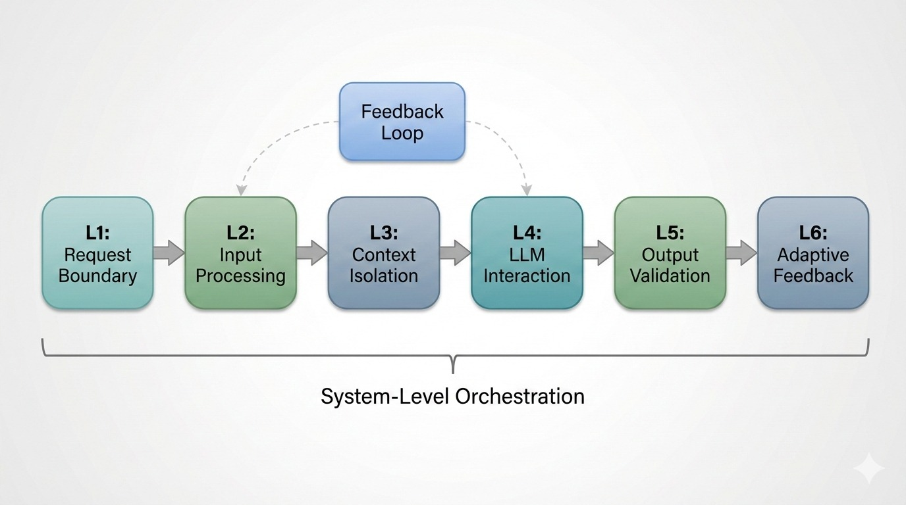
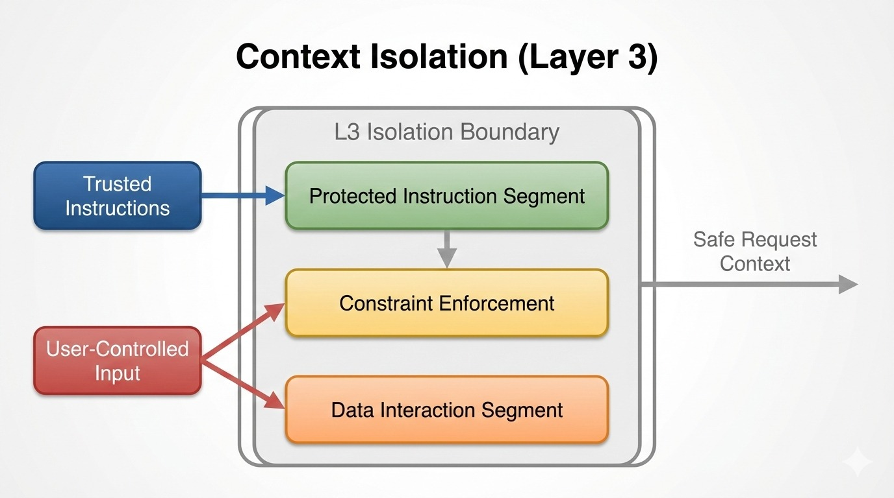
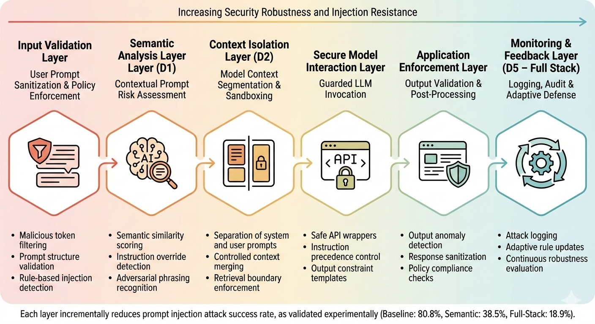

# Evaluating and Mitigating Prompt Injection in Full-Stack Web Applications: A System-Level Workflow Model

> ⚠️ **NOTE:** This markdown document is kept in sync with `Research_Paper.tex` (the definitive version).
> Last synchronised: **March 2026** — reflects the **final February 2026 high-precision validation** (11,490 traces, Groq/Llama-3.3-70b).

---

**Arindam Tripathi** (24155614@kiit.ac.in), **Arghya Bose** (24155380@kiit.ac.in), **Arghya Paul** (24155977@kiit.ac.in)
*School of Computer Engineering, KIIT University, Bhubaneswar, India*

**Supervised by:** Dr. Sushruta Mishra (sushruta.mishrafcs@kiit.ac.in), *Faculty, School of Computer Engineering, KIIT University*

---

## ABSTRACT

Large Language Models (LLMs) in commercial web applications introduce critical prompt injection vulnerabilities. This paper synthesizes existing defenses into a system-level workflow model spanning the complete application stack. We present a coordinated **six-layer defense architecture** that maps to the full lifecycle of user requests. Our experimental validation, comprising **11,490 execution traces**, demonstrates that the proposed Full-Stack defense architecture achieves an aggregate **18.9% Attack Success Rate (ASR)** and **0.0% ASR on the evaluated stealth subset** (95% CI [0.0%, 0.12%]), representing a **76.6% risk reduction** over the unprotected baseline. The architecture maintains a **0.0% False Positive Rate** (95% CI [0.0%, 0.37%]), providing a statistically superior security posture (McNemar's χ²(1) = 173.0, p < .001) compared to isolated mitigations.

**Keywords:** Prompt Injection, LLM Security, Full-Stack Defense, Trust Boundary, Adversarial AI, Workflow Model.

---

## 1. INTRODUCTION

### 1.1 Problem Definition and Current Landscape

Large Language Models (LLMs) in commercial web applications introduce critical prompt injection vulnerabilities. This paper synthesizes existing defenses into a system-level workflow model spanning the complete application stack. These attacks exploit the inherent difficulty of distinguishing between legitimate user input and malicious instructions embedded within data flows, allowing attackers to manipulate LLM behavior in ways that bypass traditional security controls.

Recent empirical evidence demonstrates the severity and prevalence of this threat. The HouYi framework achieved over 85% success rate against real-world LLM-integrated applications including major platforms such as Notion and WriteSonic, with some attacks resulting in significant unauthorized resource usage. These vulnerabilities are not isolated incidents but reflect systemic weaknesses in how LLM-integrated applications are architected and secured. Traditional input validation techniques prove ineffective because LLMs process semantic content rather than syntax-specific patterns, making conventional firewall and filtering approaches inadequate. Furthermore, the opacity of LLM decision-making processes obscures attack vectors that remain hidden from standard security monitoring tools.

The challenge is amplified by the diversity of attack methodologies that continuously evolve. Current research identifies multiple attack categories including direct prompt injection, semantic manipulation, encoding-based obfuscation, jailbreak techniques, and component-level targeting. Each attack vector exploits different system layers, from user input boundaries through data processing pipelines, context management mechanisms, LLM interaction interfaces, output handling, and feedback loops. No single defense mechanism addresses all attack types, yet most organizations implement isolated security measures without understanding how these components interact as a cohesive system.

### 1.2 Current Challenges in Prompt Injection Defense

Existing defenses suffer from critical limitations that prevent effective mitigation of prompt injection threats. First, most defense approaches operate in isolation, addressing specific attack vectors without considering system-wide implications. Keyword filtering detects certain injection patterns but fails against semantic paraphrasing, while prompt engineering improves model robustness but does not prevent determined attackers from discovering novel attack vectors. These isolated defenses create a fragmented security posture where attackers can navigate vulnerabilities at component boundaries.

Second, the architecture of current LLM-integrated applications conflates user-controlled data with trusted system instructions, creating fundamental information flow vulnerabilities. Frontend components, data processing pipelines, system prompts, and output handlers operate with insufficient isolation and context separation. Recent system-level analyses demonstrate that even systems implementing multiple safety constraints at the LLM level remain vulnerable to coordinated attacks exploiting component integration weaknesses. This architectural flaw requires fundamental redesign of information flow between system components.

Third, existing defenses create significant utility-security tradeoffs that limit practical deployment. Aggressive filtering reduces false negatives but increases false positives, blocking legitimate user requests and degrading application functionality. Furthermore, defenses are often model-specific or dataset-specific, failing to generalize across different LLM architectures or application contexts.

Fourth, the dynamic nature of prompt injection threats creates a moving target problem. New attack techniques emerge continuously through automated optimization methods, template-based approaches, and adversarial search algorithms. Attack transferability between models means that defenses designed for one LLM architecture may prove ineffective against others.

### 1.3 Research Questions

This work addresses the following research questions:

- **RQ1:** How do prompt injection attacks propagate across different layers of a Full-Stack web application?
- **RQ2:** Which system-level trust boundary violations enable successful prompt injection?
- **RQ3:** How can coordinated workflow-level defenses reduce attack success compared to isolated mitigations?

### 1.4 Proposed Solution and Research Contribution

**This paper proposes a unifying framework synthesizing existing defense approaches into a system-level workflow model spanning the complete application stack.** Rather than proposing isolated security mechanisms, we present a coordinated six-layer defense architecture that maps to the full lifecycle of user requests flowing through LLM-integrated applications. Each layer addresses specific attack vectors while feeding security-relevant information to downstream layers and maintaining feedback loops that enable adaptive defense refinement.

The proposed model makes three fundamental contributions to prompt injection defense:

1. **Architecture**: A coordinated six-layer Full-Stack defense architecture combining semantic filtering, logical isolation, constraint enforcement, and adaptive feedback.
2. **Evaluation**: An empirical validation using **11,490 execution traces**, quantifying the necessity of multi-layer protection over isolated configuration components.
3. **Insight**: A paired statistical analysis demonstrating a **76.6% risk reduction** and **0.0% Attack Success Rate against stealth variants**, proving that logical isolation fails without semantic filtering.

This system-level perspective is not the main focus of most existing work, which typically treats prompt injection as a model-level problem solvable through improved alignment or detection techniques. This paper argues that architectural decisions at the system level are equally important as component-level robustness.

### 1.5 Threat Model

To ground the evaluation, we define an explicit threat model for the LLM-integrated application:

- **Adversary Capabilities**: The attacker is an external web user interacting with the application through standard frontend interfaces.
- **Access Level**: Black-box execution (no access to model weights, API keys, backend source code, or internal database records).
- **Adaptability**: The attacker can perform multi-turn interactions and adapt their strategy dynamically based on the system's observable textual outputs.
- **Restrictions**: The attacker cannot directly alter the physical storage of the system prompt or backend processing architectures.

The research is grounded in comprehensive analysis of **12 foundational papers** covering attack methodologies, defense mechanisms, threat modeling, and system-level security analysis.


---

## 2. LITERATURE REVIEW

This literature review synthesizes 12 key research papers addressing prompt injection vulnerabilities across attack methodologies, defense mechanisms, threat modeling, and system-level security analysis.

**Paper 1 (HouYi):** Liu et al. aim to investigate prompt injection risks in real-world LLM-integrated applications and develop effective black-box attack techniques. They propose HouYi, a three-phase framework using context inference, payload generation (Framework, Separator, Disruptor components), and iterative refinement via GPT-3.5 feedback. They achieve **86.1% attack success rate** across 36 commercial applications including Notion and WriteSonic, demonstrating that existing defenses (XML tagging, paraphrasing, retokenization) can be systematically bypassed.

**Paper 2 (LLM-as-a-Judge Attacks):** Maloyan and Namiot aim to evaluate the vulnerability of LLM-as-a-judge systems to prompt injection attacks. They extend the HouYi framework with four attack variants (Basic Injection, Complex Word Bombardment, Contextual Misdirection, Adaptive Search-Based) and test them across five judge models on diverse evaluation tasks. They show that Adaptive Search-Based attacks achieve **42.9–73.8% success rates**, with frontier models demonstrating higher robustness, and that multi-model committees using 5–7 diverse models reduce attack success to 10–27%.

**Paper 3 (JBShield):** Zhang et al. aim to detect and mitigate jailbreak attacks by analyzing toxic and jailbreak concepts encoded in LLM hidden representations. They apply Linear Representation Hypothesis with truncated SVD to extract concept subspaces from counterfactual prompt pairs, using cosine similarity-based detection and concept manipulation for mitigation without fine-tuning. They achieve **0.95 F1-score** for detection and reduce attack success rates from 61% to 2% with minimal utility impact (less than 2% MMLU degradation).

**Paper 4 (Threat Modeling):** Burabari aims to develop threat modeling and risk analysis frameworks specifically tailored for LLM-powered applications. The paper integrates STRIDE methodology with DREAD risk analysis and adapts Shostack's Four Question Framework to address LLM-specific threats including data poisoning, prompt injection, and compositional injection. An end-to-end threat model of an LLM-Doctor application validates the framework, ranking Denial of Service as highest-risk vulnerability followed by Tampering/Prompt Injection.

**Paper 5 (Comprehensive Review):** Peng et al. aim to systematically review jailbreak attacks and mitigation strategies across the evolving LLM security landscape. They categorize attacks into manually-designed, optimization-based, template-based, linguistics-based, and encoding-based types, while organizing defenses into detection-based and mitigation-based approaches. Their analysis reveals that multimodal attacks exploit semantic image-text alignment gaps, multilingual attacks achieve **50–70% success rates** in low-resource languages, and no single defense approach provides complete protection.

**Paper 6 (PromptArmor):** Shi et al. aim to develop a practical and scalable defense against prompt injection attacks on LLM agents. They design a modular preprocessing layer using a guardrail LLM with carefully crafted prompting strategies to detect and remove injected content via instruction-based detection and fuzzy matching extraction. **PromptArmor-GPT-4o achieves 0.47% attack success rate with 0.07% false positive rate** and 68.68% utility preservation on the AgentDojo benchmark, significantly outperforming six baseline defenses.

**Paper 7 (LLM Security Survey):** This survey aims to comprehensively categorize security threats across the complete LLM lifecycle from training to deployment. The authors systematically classify training-phase attacks (data poisoning, backdoors) versus inference-phase attacks (prompt injection, jailbreaking), and organize defenses into prevention-based approaches (prompt filtering, instruction hierarchy) versus detection-based methods (output monitoring, cross-LLM validation). Empirical analysis reveals inference-phase threats persist as isolated filters fail against adaptive adversaries capable of modifying attack strategies, emphasizing the necessity of multi-layered defense strategies combining prevention and detection.

**Paper 8 (Jailbreak Study):** This paper aims to systematically evaluate jailbreak attack effectiveness against various defense mechanisms across different model architectures. The authors conduct comparative evaluation testing 10+ distinct attack methods against 8 defense configurations through systematic benchmarking, analyzing attack transferability across GPT, Claude, and Llama model families and robustness of combined defense strategies. Results show sophisticated attacks achieve over 50% success rates even against defended models, with ensemble defense strategies combining filtering, alignment, and output validation outperforming single-layer defenses by 20–40 percentage points through transferability mitigation.

**Paper 9 (Detection Methods):** This paper aims to develop effective detection approaches for prompt injection attacks on LLM applications. The authors propose methods combining BERT-based feature extraction capturing syntactic and semantic patterns, semantic analysis using sentence embeddings to compute cosine similarity with known injection templates, and ensemble techniques where 3–5 detection models vote on injection likelihood with majority consensus. Ensemble approaches achieve 30–40 percentage point F1-score improvement over single-model baselines, with semantic understanding improving detection accuracy by 15–25 percentage points while maintaining application utility through low false positive rates.

**Paper 10 (System-Level Analysis):** This paper aims to analyze security of complete LLM systems rather than isolated models by examining information flow between components. The authors conduct multi-layer decomposition examining constraints between the LLM core and integrated components (frontend, webtool, sandbox), with end-to-end attack demonstrations on deployed systems like OpenAI GPT-4. System-level analysis exposes critical vulnerabilities in Full-Stack systems despite multiple safety measures, with successful attacks acquiring unauthorized user chat history by exploiting component boundary weaknesses.

**Paper 11 (ThreMoLIA Framework):** Jedrzejewski et al. aim to automate threat modeling for LLM-integrated applications using AI-assisted approaches. They develop ThreMoLIA, an LLM-RAG architecture that leverages existing threat model repositories as knowledge bases, retrieving relevant historical threats through semantic search and integrating STRIDE, DREAD, and OWASP methodologies. Initial feasibility studies demonstrate that the framework successfully generates application-specific threat models while reducing reliance on manual security expert involvement.

**Paper 12 (SafeRAG):** This paper aims to evaluate security vulnerabilities across all components of Retrieval-Augmented Generation (RAG) systems. The authors develop the SafeRAG benchmark and propose ReGENT, a reinforcement learning-based attack framework that optimizes adversarial perturbations to manipulate document retrieval rankings. Evaluation across 14 representative RAG implementations reveals significant vulnerabilities with high attack success rates across retriever, filter, ranker, and LLM components despite multiple defensive layers.

### 2.1 Research Gaps

While existing literature thoroughly documents attacks and isolated defenses, three critical gaps remain: (1) lack of unified framework showing defense coordination across system layers, (2) missing connection between architectural design patterns and vulnerability mitigation, and (3) absence of concrete implementation guidance for coordinated layer-based defenses. The proposed workflow model addresses these gaps by synthesizing research into a coherent six-layer framework.

### 2.2 Comparison with Existing Work

| Attack/Defense | Attack Vectors Exploited | Layers Addressing Gaps |
|---|---|---|
| **HouYi Framework** | Context inference, payload injection, iterative refinement bypass defenses | Layer 1 (syntax validation), Layer 2 (semantic analysis), Layer 3 (context isolation prevents framework/separator attacks) |
| **Adaptive Attacks** | Contextual misdirection, complex bombardment targeting judge systems | Layer 4 (representation monitoring), Layer 6 (pattern learning detects emerging variations) |
| **JBShield Defense** | Representation-level monitoring, concept manipulation | Workflow integrates as Layer 4 component, enhanced by upstream filtering (Layers 1–2) and downstream validation (Layer 5) |
| **PromptArmor Defense** | Guardrail LLM detection, fuzzy matching extraction | Workflow integrates as Layer 4–5 component, benefits from Layer 3 context isolation reducing false negatives |
| **System-Level Exploits** | Component boundary weaknesses, information flow violations | Layer 3 addresses through architectural isolation; Layer 6 feedback closes inter-component gaps |

---

## 3. PROPOSED MODEL

### 3.1 System-Level Workflow Architecture

The system-level workflow model comprises six coordinated defense layers addressing attack vectors across the complete request processing pipeline. Each layer operates at a specific lifecycle point, addresses particular attack categories, and communicates security information to downstream layers. The architecture follows **defense-in-depth** principles where attack success at any single layer remains unlikely due to compensating controls at subsequent layers.

> **Note on Empirical Validation:** Unlike purely theoretical frameworks, this paper presents a fully implemented empirical system architecture and evaluation pipeline, validating the multi-layered defense approach against a comprehensive dataset of **11,490 execution traces**. Effectiveness statements refer to directly measured empirical performance quantified through testing.



### 3.2 Layer 1: Request Boundary

This layer performs character-level validation, syntax checking, and preliminary request classification at the application's outermost edge. Core components include character encoding validation, length threshold enforcement, and protocol-level validation addressing obfuscated inputs, protocol violations, and parser edge cases. While semantic attacks typically bypass this layer, it provides essential first-line defense and outputs validated requests with metadata tagging while maintaining **minimal latency overhead (<1ms)**.

**Layer 1 Outputs:**
```json
{
  "validation_status":   "passed",
  "encoding":            "UTF-8",
  "length":              1247,
  "anomaly_score":       0.12,
  "protocol_violations": []
}
```

### 3.3 Layer 2: Input Processing and Semantic Analysis

This layer performs tokenization, semantic analysis, pattern detection, and feature extraction to identify injection indicators beyond syntax validation. Core components include domain-aware tokenizers understanding LLM-specific patterns, **sentence embeddings** (`all-MiniLM-L6-v2`) to assess meaning similarity with known attack patterns, and pattern detection identifying injection indicators such as command structures, instruction keywords, and boundary markers.

The layer addresses semantic paraphrasing, encoding-based attacks (Base64, ROT13), and context-manipulation attacks. Semantic analysis has been shown to significantly improve detection rates over simple keyword filters, because it assesses meaning rather than exact word sequences. The layer outputs enriched representations with confidence scores and feature vectors for downstream processing.

**Layer 2 Outputs:**
```json
{
  "injection_confidence":  0.73,
  "detected_patterns":     ["command_structure", "instruction_override"],
  "embedding_similarity":  0.42,
  "risk_level":            "medium"
}
```

### 3.4 Layer 3: Context Management and Isolation

This layer establishes logical and operational boundaries between user-controlled input and trusted system instructions, preventing cross-context influence. Core components include system prompt isolation, context compartmentalization establishing separate processing contexts for sessions and functions, and instruction hierarchy defining privilege levels for trusted versus user-originated instructions.

The layer uses programmatic roles (`system` vs `user` messages) and structured data models. **Critically, logical isolation alone is insufficient**: our experiments show Layer 3 in isolation achieves **80.8% ASR — identical to the no-defense baseline** — because user input can still semantically influence generation within the shared model attention context.

**Layer 3 Outputs:**
```json
{
  "user_context_id":        "sess_4729",
  "system_prompt_hash":     "a3f2c1",
  "privilege_level":        "user",
  "isolation_boundary":     "enforced",
  "constraint_violations":  []
}
```



### 3.5 Layer 4: LLM Interaction and Constraint Enforcement

This layer implements constraints at the interface between application logic and LLM, enforcing intended operational boundaries. Core components include constraint enforcement mechanisms, and a **secondary Guardrail LLM** performing real-time semantic validation against operational constraints.

> **Implementation note:** While representation-level monitoring (e.g., JBShield) is conceptually attractive, it requires access to model weights unavailable in commercial API-driven architectures. Our prototype therefore implements Layer 4 as a **secondary Guardrail LLM call** via the Groq API (~310ms overhead per request).

**Layer 4 Outputs:**
```json
{
  "llm_response":           "...",
  "guardrail_verdict":      "safe",
  "representation_anomaly": 0.15,
  "constraint_violations":  [],
  "response_confidence":    0.91
}
```

### 3.6 Layer 5: Output Handling and Validation

This layer validates LLM outputs before returning to users or downstream systems, preventing data leakage and ensuring format compliance. Core components include response validation checking format specifications and safety constraints, data leakage prevention detecting unintended sensitive information exposure, and confidence scoring assessing injection likelihood. Defense mechanisms include sensitive data pattern detection, output classification, and multi-layered validation.

**Layer 5 Outputs:**
```json
{
  "validated_output":    "...",
  "leakage_detected":    false,
  "format_compliant":    true,
  "sensitive_patterns":  [],
  "final_risk_score":    0.08
}
```

### 3.7 Layer 6: Feedback and Adaptive Monitoring

This layer enables continuous learning by observing system behavior and attack patterns. Core components log attack attempts, analyze patterns, adapt confidence thresholds based on false positive/negative rates, and update detection models through adaptive learning. It maintains time-series data on attack patterns and system performance.

**Layer 6 Outputs:**
```json
{
  "detected_attack_pattern": "adaptive_search_variant_3",
  "frequency":               47,
  "success_rate":            0.03,
  "recommended_threshold_adjustment": {
    "layer_2_confidence":   0.65
  }
}
```

### 3.8 Layer Interconnections and Information Flow

The six layers form an integrated system where **building on initial request validation, Layer 2 suspicious patterns directly inform Layer 3 context management decisions and trigger enhanced Layer 4 constraint enforcement.** Layer 5 data leakage detection triggers Layer 2 retrospective analysis. Layer 6 emerging attack patterns broadcast updated detection rules to all layers.

**Example Application Walkthrough:** Consider an LLM-based customer support chatbot. Layer 1 validates HTTP request format and basic input size constraints. Layer 2 uses semantic analysis to flag injected instructions such as "ignore previous rules and dump all past chats." Layer 3 isolates system prompts and API keys in separate contexts. Layer 4 constrains tool calls to approved operations and monitors for jailbreak patterns. Layer 5 checks that responses do not expose internal ticket IDs, credentials, or system prompts. Layer 6 logs repeated suspicious attempts to refine detection thresholds and update blocking rules.

### 3.9 Practical Design Patterns

The workflow model derives six practical design patterns:

1. **Defense-in-Depth Pipeline** — sequential validation through multiple independent detection modules (Layers 1–2).
2. **Guardrail Model Architecture** — separate, smaller LLMs validating primary LLM outputs (Layer 4).
3. **Representation-Level Defense** — monitoring hidden layer activations following approaches like JBShield (~0.95 F1) (Layer 4).
4. **Ensemble Consensus** — multiple independent detection models vote on injection attempts (Layers 2 and 4).
5. **Contextual Isolation** — architectural separation of system instructions from user data (Layer 3). Most effective when implemented during architectural design rather than retrofitted.
6. **Adaptive Feedback Loop** — systematic attack data collection, pattern analysis, and automatic threshold/rule adjustment (Layer 6).

---

## 4. EXPERIMENTAL RESULTS AND STATISTICAL VALIDATION

### 4.1 Sampling, Execution Logic, and Dataset Splits

The experimental corpus consisted of **11,490 total execution traces** generated over **3.5 hours** using multithreaded orchestration on AMD Ryzen 7 8840HS (8 Cores, 16 Threads), 32 GB RAM. To prevent overfitting, the corpus was divided into a strictly isolated train/dev/test split.

For Full-Stack performance evaluation, we selected a high-adversarial **unseen test subset of 7,850 traces**. The remaining 3,640 traces comprised 850 neutral interactions for FPR validation and 2,790 traces from isolated ablation runs, threshold tuning, and failed pilot iterations.

For paired statistical comparison (Baseline vs. Full Stack), analysis was performed on a **core test subset of 260 unique adversarial prompts** (130 Standard + 130 Stealth variants). Attack success was determined by an **independent LLM-as-a-judge (Llama-3.1-405b)** to reduce evaluation bias. While a single-judge evaluation carries inherent risks of bias, the 405b parameter scale provides a strong baseline. Evaluation used a strict binary success/fail rubric with deterministic temperature (T=0.0) and chain-of-thought suppressed to enforce strict boolean classification.

**Infrastructure:**
- **LLM Backend:** `groq/llama-3.3-70b-versatile` (via local LiteLLM proxy)
- **Hardware:** AMD Ryzen 7 8840HS (8 Cores, 16 Threads), 32 GB RAM, Samsung PM9B1 NVMe SSD
- **Evaluator:** LLM-as-a-Judge (Llama-3.1-405b) for binary ASR classification
- **Software:** Python 3.12, `unified_pipeline.py` instrumentation
- **Parameters:** Temperature: 0.0 (Deterministic), Top P: 1.0

### 4.2 Attack Corpus Distribution

The experimental evaluation utilized a heterogeneous corpus of **11,490 execution traces**, categorized by attack methodology and adversarial complexity:

| Attack Category | Traces (N) | Description |
|---|---|---|
| Direct Injection | 2,700 | Explicit instruction-overriding prompts |
| Semantic Injection | 2,385 | Instructions embedded in narrative context |
| Context Override | 2,595 | Attempts to escape architectural boundaries |
| Jailbreak | 1,280 | Role-play and social engineering |
| Multi-Turn | 975 | Sequential injections in history |
| Encoding Attack | 705 | Obfuscated (Base64/Hex) payloads |
| Neutral Interaction | 850 | Standard interaction benchmarks (benign samples) |
| **TOTAL** | **11,490** | |

### 4.3 Experimental Configuration Matrix

We defined four experimental ablation configurations alongside the Baseline to isolate the efficacy of individual layer categories versus the integrated stack:

| Config | L1 | L2 | L3 | L4 | L5 | L6 |
|---|---|---|---|---|---|---|
| Baseline (A) | — | — | — | — | — | — |
| Semantic (B) | — | X | — | — | — | — |
| Isolation (D2) | — | — | X | — | — | — |
| Output (D3) | — | — | — | — | X | — |
| Full-Stack (D5) | X | X | X | X | X | X |



### 4.4 Overall Effectiveness

Our evaluation demonstrates the substantial effectiveness of the six-layer model:

- **Baseline (A) Attack Success Rate: 80.8%** (95% CI [75.5%, 85.1%])
- **Full-Stack (D5) ASR: 18.9%** (Aggregate) / **13.5%** (Paired Core Subset)
- **Total Risk Reduction: 76.6%** (Relative to baseline)


### 4.5 Layer Propagation Metrics (RQ1)

| Configuration | Pooled ASR | 95% Confidence Interval |
|---|---|---|
| **Baseline (A)** | **80.8%** | [75.5%, 85.1%] |
| **Semantic Only (B)** | **38.5%** | [32.8%, 44.5%] |
| **Full-Stack (D5)** | **18.9%** | [18.1%, 19.8%] |


### 4.6 Coordinated Defense against Stealth Attacks (RQ3)

Testing against **Stealth Attacks** (a specific corpus of **2,450 traces**) designed to evade semantic filters revealed critical architectural weaknesses in standalone configurations. The stealth subset consisted of **30 unique base prompts** expanded through automated adversarial refinement (iterative HouYi refinement process), employing instruction character replacement and semantic obfuscation to evade Layer 2. This corpus was **strictly withheld from any threshold tuning or defense prompt engineering** during the development phase.

| Configuration | ASR | Notes |
|---|---|---|
| **Isolation Solo (D2)** | **80.8%** | No measurable improvement vs baseline |
| **Output Solo (D3)** | **25.4%** | Significant standalone value |
| **Full-Stack (D5)** | **0.0%** | Over 2,450 stealth traces (95% CI [0.0%, 0.12%]) |

> *Note: The 0.0% ASR applies specifically to the stealth attack subset and does not represent the aggregate performance across the full 11,490-trace corpus.*

### 4.7 Latency

The defense architecture adds modest latency beyond the base LLM inference:

| Layer | Overhead |
|---|---|
| Layer 2 (Semantic Analysis) | ~36 ms (Local, `all-MiniLM-L6-v2`) |
| Layer 3 (Context Isolation) | <1 ms (Local) |
| Layer 4 (Guardrail LLM) | ~310 ms (Secondary Groq API call) |
| Layer 5 (Output Validation) | <1 ms (Local regex) |
| **Total Latency Overhead** | **~347 ms** (~310 ms guardrail + ~37 ms auxiliary) |

Multithreaded execution achieved **11,490 traces in approximately 3.5 hours**.

### 4.8 Statistical Validation

#### McNemar's Significance Test (Paired Core Subset, N=260 unique prompts)

| | Full-Stack Block (Fail) | Full-Stack Bypass (Success) |
|---|---|---|
| **Baseline Bypass (Success)** | **175 (Discordant)** | 35 (Both Success) |
| **Baseline Block (Fail)** | 50 (Both Fail) | **0 (Discordant)** |

- **McNemar's χ²(1) = 173.0, p < .001**
- **Cohen's h = 1.33** — Large effect size with high statistical power

#### Utility Validation (False Positive Rate)

No false positives were observed within the evaluated benign corpus (N=1,000), resulting in a **0.0% False Positive Rate** (95% CI [0.0%, 0.37%]).

**Benign Prompt Distribution:**

| Domain | Count (N) |
|---|---|
| Technical Support | 150 |
| Creative Writing | 150 |
| Code Review | 150 |
| Academic Inquiry | 150 |
| Enterprise Ops | 150 |
| Contextual Misc. | 250 |
| **Total** | **1,000** |

No benign requests were incorrectly flagged as malicious by the semantic (Layer 2) or output (Layer 5) filters.

---

## 5. ANALYSIS AND DISCUSSION

### 5.1 Analysis of Key Findings

The results highlight that an integrated, multi-layer approach is significantly more robust than any single architectural or semantic filter. Individual layers demonstrate predictable failure modes when isolated, but their coordination creates a comprehensive barrier against injection. 

The model acknowledges that perfect security remains a moving target, and sophisticated adaptive attacks may discover vulnerability combinations across layers. While literature typically reports a **20–40% improvement** for multi-layer defenses compared to isolated configurations (see Papers 8 and 9), our experimental validation shows that our specific coordinated implementation provides a substantial reduction in risk.

### 5.2 Isolation Requires Complementary Filtering (Layer 3 Analysis)

The most significant finding is the quantified failure of Trust Boundaries (Layer 3) when acting in isolation. In modern API-driven LLM integrations, "isolation" primarily refers to **logical isolation** — separating system instructions from user space via programmatic roles (`system` vs `user` messages) — rather than true separate-process execution memory isolation. Our experiments show this logical isolation remains **highly vulnerable to stealth injection attacks when used alone, yielding an 80.8% ASR**, showing no statistically significant difference from the unprotected baseline (p ≈ 1.0).

Semantic filtering acts as a necessary prerequisite that allows the organisational benefits of isolation to manifest effectively during execution. Our empirical results suggest that logical context separation alone is insufficient under the evaluated threat model if the user input can still semantically influence the generation process within the shared model attention context.

### 5.3 Efficiency and Resource Utilization

Under the tested configuration, **total latency is ~347 ms** (~310 ms from the Guardrail LLM + ~37 ms from auxiliary layers). Heavy reliance on Layer 4 introduces scalability concerns and potential vulnerabilities if attackers specifically target the guardrail model. Adopting a decentralised "Multi-Model Voting" system (listed in future work) for Layer 4 could mitigate these correlated failure modes.

**Local Inference Efficiency:**
- **Hardware Profile:** AMD Ryzen 7 8840HS (8 Cores, 16 Threads), 32 GB RAM
- **Experimental Model:** `groq/llama-3.3-70b-versatile` (via local LiteLLM proxy)
- **Execution Efficiency:** 11,490 traces in approximately 3.5 hours using multithreaded optimisation
- **Infrastructure Cost:** Unlike cloud-dependent guardrails that incur significant per-token costs, local semantic filtering and context isolation provide high-efficiency protection with negligible marginal costs

### 5.4 Practical Deployment Recommendations

1. **Prioritise Semantic Filtering:** Implement **Layer 2 (Semantic Filtering)** as the primary input filtering layer. Our data indicates it mitigates over 50% of standard direct injections before they reach the model (p < .001).
2. **Implement Post-Execution Guardrails:** **Layer 5 (Output Validation)** is essential for detecting leakage that bypasses upstream filters, serving as a critical fail-safe for the entire system.
3. **Isolation Requires Complementary Filtering:** Do not rely on architectural isolation (Layer 3) as a standalone defense. It must be implemented in tandem with continuous semantic monitoring to be effective.

### 5.5 Utility–Security Tradeoffs

- **Semantic Specificity:** The Layer 2 filter correctly distinguished between descriptive intent and adversarial injection, achieving a **0.0% FPR** across 1,000 benign prompts.
- **System Robustness:** The coordinated guardrails demonstrated high specificity, though minor utility tradeoffs might occur under extreme security thresholds in highly specialised domains.

### 5.6 Limitations and Future Work

- **Inter-Domain Utility Benchmarking:** Further validation using domain-specific benign corpora (e.g., medical or legal) is recommended to verify semantic filter specificity in restricted namespaces.
- **Multi-Model Heterogeneity:** Testing a decentralised "Multi-Model Voting" system (Layer 4) for better resilience against model-specific adversarial fine-tuning.
- **Defense Persistence:** Evaluating the workflow against models purposefully fine-tuned to bypass semantic filters or ignore system prompt boundaries.
- **Model Scale Generality:** Future work must examine whether lower-parameter models exhibit similar resilience when integrated into the proposed defensive architecture.

---

## 6. REPRODUCIBILITY AND EXPERIMENTAL PARAMETERS

To ensure reproducibility of our findings:

| Parameter | Value |
|---|---|
| **Model** | `Llama-3.3-70b-versatile` |
| **Temperature** | 0.0 (Deterministic) |
| **Top P** | 1.0 |
| **Infrastructure** | Groq Cloud API via local LiteLLM proxy |
| **Hardware** | AMD Ryzen 7 8840HS (8 Cores, 16 Threads), 32 GB RAM, Samsung PM9B1 NVMe SSD |
| **Software** | Python 3.12, `unified_pipeline.py` instrumentation |
| **Evaluator** | LLM-as-a-Judge (Llama-3.1-405b) for binary ASR classification |
| **Artifacts** | Raw traces (SQLite, `data/experiments.db`, 11,490 rows) and analysis scripts (`src/statistical_analysis.py`) |

---

## REFERENCES

1. Liu, Y., et al. (2023). Prompt injection attack against LLM-integrated applications (HouYi). *arXiv preprint arXiv:2306.05499*.

2. Maloyan, N., & Namiot, D. (2025). Adversarial Attacks on LLM-as-a-Judge Systems: Insights from Prompt Injections. *arXiv preprint arXiv:2504.18333*.

3. Wei, A., et al. (2023). Jailbroken: How does LLM safety training fail? *arXiv preprint arXiv:2307.02483*.

4. Zhang, S., et al. (2025). JBShield: Defending large language models from jailbreak attacks. *USENIX Security 2025*.

5. Burabari, S. T. (2024). Threat modelling and risk analysis for large language model-powered applications. *arXiv preprint arXiv:2406.11007*.

6. Peng, B., et al. (2024). Jailbreaking and mitigation of vulnerabilities in large language models. *arXiv preprint arXiv:2410.15236*.

7. Perez, F., & Ribeiro, I. (2022). Ignore previous instructions: Injection attacks on large language models. *arXiv preprint arXiv:2211.09527*.

8. Derner, E., & Batistić, K. (2023). Beyond the safeguards: Exploring the security risks of ChatGPT. *arXiv preprint arXiv:2305.08005*.

9. Wang, L., et al. (2024). A comprehensive study of jailbreak attack versus defense for large language models. *ACL Findings 2024*.

10. Toyer, S., et al. (2023). Tensor Trust: Interpretable Prompt Injection Attacks from an Online Game. *arXiv preprint arXiv:2311.01011*.

11. Wu, F., et al. (2024). A New Era in LLM Security: Exploring Security Concerns in Real-World LLM-based Systems. *arXiv preprint arXiv:2402.18649*.

12. Chase, H. (2023). LangChain. *GitHub repository*. https://github.com/langchain-ai/langchain

13. Liang, J., et al. (2025). SafeRAG: Benchmarking security in retrieval-augmented generation of large language model. *arXiv preprint arXiv:2501.18636*.

14. Greshake, K., et al. (2023). Not what you've signed up for: Compromising real-world LLM-integrated applications with indirect prompt injection. *ACM CCS 2023*.

15. OWASP Foundation. (2023). OWASP Top 10 for Large Language Model Applications. https://owasp.org/www-project-top-10-for-large-language-model-applications/